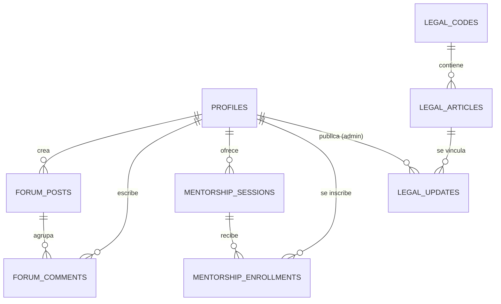

# ⚖ IusZac — Derecho Digital

## Documentación Técnica y de Pantallas · Versión 5.0
*Estado actualizado del proyecto — Junio 2026*

────────────────────────────────────────────────────────────────────────────────

### Leyenda de Estado de Implementación

*   **✅ Implementado:** Funcionalidad completa y conectada a la base de datos de Supabase.
*   **⚠️ Parcial:** Interfaz construida pero con pendientes de backend menores o filtros específicos en desarrollo.
*   **🔲 Pendiente:** En fase de planeación de interfaz y lógica.
*   **🆕 Nuevo v4.1:** Especificación nueva añadida en esta versión.

---

## 1. Resumen Ejecutivo y Stack Tecnológico

IusZac es una plataforma integral para la comunidad legal de Zacatecas. Facilita el acceso a la legislación actualizada local y federal, alertas de reformas estructuradas comparativamente, foros de debate dinámicos con uso de hashtags, y un directorio de mentorías con caducidad automatizada. La plataforma distingue tres tipos de usuarios con distintos niveles de acceso y capacidades de publicación.

### Stack Técnico Homologado

| **Capa** | **Tecnología** | **Detalles Técnicos** |
| --- | --- | --- |
| **Frontend** | Flutter 3.x (Dart) | Compilado para Web (HTML/Canvas) y optimizado como PWA instalable en móviles y desktop. |
| **Manejo de Estado** | `flutter_riverpod` | Inyección de dependencias reactivas a través de Providers, FutureProviders y StreamProviders. |
| **Enrutamiento** | `go_router` | Navegación por ShellRoute con barra de navegación en móvil y NavigationRail en pantallas ≥800px. Guards de ruta según permisos de usuario (`can_mentor`, `can_publish`, `can_moderate`, `can_manage_users`) y estado de suspensión. |
| **Backend** | Supabase (PostgreSQL) | DB relacional, Autenticación integrada, políticas RLS activas y Triggers automáticos. |
| **Tipografía** | Google Fonts - Outfit | Estilo moderno, legible y de alta fidelidad estética. |
| **CI / CD** | GitHub Actions | Pipeline `deploy.yml` para compilar la web e inyectar el base-href automáticamente en gh-pages. |

---

## 2. Sistema de Tipos de Usuario

> **Distinción importante:** Los tipos de usuario (`user_type`) son independientes de las etiquetas de perfil profesional (`label`). Un usuario puede ser Docente (etiqueta) pero tener tipo `user` (sin privilegios de mentor), o ser un Estudiante (etiqueta) con tipo `mentor` si fue promovido por un administrador.

### 2.1 Tipos de Usuario (`user_type`)

| **Tipo** | **Valor en BD** | **Capacidades** |
| --- | --- | --- |
| **Usuario Normal** | `user` | Consultar contenido legal, participar en foros, inscribirse a mentorías. |
| **Mentor** | `mentor` | Todo lo de `user` + publicar, editar y eliminar sus propias sesiones de mentoría. |
| **Administrador** | `admin` | Todo lo anterior + gestionar usuarios, publicar reformas/noticias, moderar contenido (borrar posts u comentarios ofensivos), promover/revocar el rol mentor, y **suspender usuarios por un periodo de tiempo determinado**. |

### 2.2 Etiquetas de Perfil Profesional (`label`)

Estas etiquetas son informativas y se muestran públicamente en el perfil. No otorgan permisos adicionales por sí solas.

| **Etiqueta** | **Descripción** |
| --- | --- |
| Estudiante | Usuario en formación académica. |
| Docente | Académico o profesor universitario. |
| Postulante | En proceso de titulación o examen. |
| Investigador | Perfil enfocado en investigación jurídica. |
| Practicante | En etapa de prácticas profesionales. |

---

## 3. Modelo de Datos (Supabase PostgreSQL)

El backend de Supabase expone las siguientes tablas con seguridad RLS habilitada:



### 3.1 Detalle de Tablas y Columnas

#### `profiles`
| **Campo** | **Tipo** | **Descripción** |
| --- | --- | --- |
| `id` | `UUID` PK | Apunta a `auth.users`. |
| `full_name` | `TEXT` | Nombre(s). Requerido. |
| `last_name` | `TEXT` | Apellidos. Opcional. |
| `avatar_url` | `TEXT` | URL de foto de perfil. Opcional. |
| `user_type` | `TEXT` | **`user` / `admin`** — Rol base de administración. Def: `user`. |
| `can_mentor` | `BOOLEAN` | `true` si el usuario tiene permiso para dar mentorías. Def: `false`. |
| `can_publish` | `BOOLEAN` | `true` si el usuario tiene permiso para publicar reformas/noticias. Def: `false`. |
| `can_moderate` | `BOOLEAN` | `true` si el usuario tiene permiso para moderar comentarios y foro. Def: `false`. |
| `can_manage_users` | `BOOLEAN` | `true` si el usuario tiene permiso para gestionar permisos de otros usuarios. Def: `false`. |
| `label` | `TEXT` | Etiqueta profesional: `Estudiante / Docente / Postulante / Investigador / Practicante`. |
| `institution` | `TEXT` | Escuela o despacho. Opcional. |
| `semester_degree` | `TEXT` | Semestre o grado académico. Opcional. |
| `bio` | `TEXT` | Descripción corta del perfil. Opcional. |
| `phone_whatsapp` | `TEXT` | Número de celular para enlace de WhatsApp (solo relevante para mentores). Opcional. |
| `is_suspended` | `BOOLEAN` | `true` si el usuario está suspendido actualmente. Def: `false`. |
| `suspended_until` | `TIMESTAMP` | Fecha y hora en que termina la suspensión. `NULL` si no está suspendido. |
| `suspension_reason` | `TEXT` | Motivo de la suspensión registrado por el admin. Opcional. |
| `notif_alerts_reforma` | `BOOLEAN` | Def: `true`. |
| `notif_email_resumen` | `BOOLEAN` | Def: `true`. |
| `notif_foro` | `BOOLEAN` | Def: `true`. |
| `notif_mentoria` | `BOOLEAN` | Def: `true`. |
| `updated_at` | `TIMESTAMP` | Última actualización del perfil. |

> **Nota RLS:** Solo el propio usuario puede actualizar su propio perfil (excepto `user_type`, `is_suspended`, `suspended_until` y `suspension_reason`, que solo pueden ser modificados por un `admin`). Al iniciar sesión, el guard de GoRouter verifica `is_suspended` y `suspended_until`; si la suspensión sigue activa, redirige a una pantalla de aviso y cierra la sesión.

#### `legal_codes`
| **Campo** | **Tipo** | **Descripción** |
| --- | --- | --- |
| `id` | `UUID` PK | Identificador único. |
| `name` | `TEXT` | Nombre del código o ley. Ej: "Código Penal Federal". |
| `short_name` | `TEXT` | Abreviatura para mostrar en carruseles. Ej: "CPF". |
| `scope` | `TEXT` | `federal` o `estatal` — para clasificar los códigos. |
| `description` | `TEXT` | Descripción del cuerpo normativo. Opcional. |
| `status` | `TEXT` | `Vigente` / `Actualizado`. |
| `last_reform_date` | `TIMESTAMP` | Fecha de la última reforma registrada en el sistema. |

#### `legal_articles`
| **Campo** | **Tipo** | **Descripción** |
| --- | --- | --- |
| `id` | `UUID` PK | Identificador único. |
| `code_id` | `UUID` FK | Referencia a `legal_codes`. |
| `number` | `TEXT` | Número del artículo. Ej: "Art. 14". |
| `title` | `TEXT` | Nombre descriptivo del artículo. |
| `content` | `TEXT` | Texto completo vigente. |
| `last_reform_date` | `TIMESTAMP` | Fecha de la última reforma. |
| `source_official` | `TEXT` | Referencia al Periódico Oficial o DOF. |
| `has_recent_reform` | `BOOLEAN` | `true` si tiene una entrada reciente en `legal_updates`. Def: `false`. |
| `summary_reform` | `TEXT` | Resumen breve de la última modificación. |

#### `legal_updates`
| **Campo** | **Tipo** | **Descripción** |
| --- | --- | --- |
| `id` | `UUID` PK | Identificador único. |
| `title` | `TEXT` | Título de la noticia o reforma. |
| `content` | `TEXT` | Resumen detallado del cambio. |
| `category` | `TEXT` | Categoría temática: Reforma / Adición / Derogación / Corrección / Noticia. |
| `image_url` | `TEXT` | Imagen ilustrativa opcional. |
| `published_at` | `TIMESTAMP` | Fecha de publicación configurada por el admin. |
| `created_at` | `TIMESTAMP` | Fecha de inserción real en la BD. |
| `author_id` | `UUID` FK | Referencia al perfil admin que publicó. |
| `article_id` | `UUID` FK | Artículo legal afectado. Opcional. |
| `old_content` | `TEXT` | Texto anterior para vista comparativa. Opcional. |
| `new_content` | `TEXT` | Texto nuevo para vista comparativa. Opcional. |

> **Nota RLS:** Solo perfiles con `user_type = admin` pueden ejecutar `INSERT`, `UPDATE` o `DELETE` en esta tabla.

#### `forum_posts`
| **Campo** | **Tipo** | **Descripción** |
| --- | --- | --- |
| `id` | `UUID` PK | Identificador único. |
| `title` | `TEXT` | Título del hilo. |
| `content` | `TEXT` | Descripción completa del problema o consulta. |
| `user_id` | `UUID` FK | Autor del hilo. |
| `created_at` | `TIMESTAMP` | Fecha de creación. |
| `is_urgent` | `BOOLEAN` | Marca el hilo como urgente. Def: `false`. |
| `tags` | `TEXT[]` | Hashtags asociados al hilo. |
| `reply_count` | `INT` | Contador denormalizado de comentarios. Def: `0`. |
| `is_closed` | `BOOLEAN` | `true` cuando el autor cierra el hilo. Def: `false`. |
| `closed_at` | `TIMESTAMP` | Fecha en que se cerró el foro. Nullable. |

> **Nota RLS — Edición/Eliminación:** El autor puede `UPDATE` o `DELETE` su propio post solo si `is_closed = false`. Los admins pueden borrar cualquier post. Nadie puede editar un post con `is_closed = true`.

#### `forum_comments`
| **Campo** | **Tipo** | **Descripción** |
| --- | --- | --- |
| `id` | `UUID` PK | Identificador único. |
| `post_id` | `UUID` FK | Hilo al que pertenece. |
| `user_id` | `UUID` FK | Autor del comentario. |
| `content` | `TEXT` | Texto de la respuesta. |
| `is_solution` | `BOOLEAN` | Marcado como solución aceptada por el autor del post. Def: `false`. |
| `created_at` | `TIMESTAMP` | Fecha de creación. |

> **Nota RLS — Edición/Eliminación:** El autor puede editar/borrar su comentario solo si el `forum_post` padre tiene `is_closed = false`. Los admins pueden borrar cualquier comentario.

#### `mentorship_sessions`
| **Campo** | **Tipo** | **Descripción** |
| --- | --- | --- |
| `id` | `UUID` PK | Identificador único. |
| `mentor_id` | `UUID` FK | Referencia al perfil con `can_mentor = true`. |
| `title` | `TEXT` | Título descriptivo de la sesión. |
| `specialty` | `TEXT` | Área del derecho. Usado como filtro de búsqueda. |
| `description` | `TEXT` | Objetivos, temario y requisitos de la sesión. |
| `price` | `NUMERIC` | Costo en MXN. `0` = Gratis. Def: `0`. |
| `available_slots` | `INT` | Cupos disponibles. Def: `10`. |
| `session_date` | `TIMESTAMP` | Opcional (NULL). Fecha y hora programada (histórico). |
| `schedule` | `JSONB` | Arreglo de bloques de horario por día: `[{"day": "Lunes", "startTime": "HH:MM", "endTime": "HH:MM"}, ...]`. Admite múltiples horarios por día o partidos. |
| `expires_at` | `TIMESTAMP` | Fecha límite de vigencia; sesiones pasadas no se muestran. |
| `created_at` | `TIMESTAMP` | Fecha de creación del registro. |

> **Nota RLS:** Solo perfiles con `can_mentor = true` pueden hacer `INSERT` en esta tabla. Un mentor solo puede `UPDATE` o `DELETE` sus propias sesiones y únicamente si la mentoría no ha expirado (`expires_at > NOW()`).

#### `mentorship_enrollments`
| **Campo** | **Tipo** | **Descripción** |
| --- | --- | --- |
| `id` | `UUID` PK | Identificador único. |
| `session_id` | `UUID` FK | Sesión a la que se inscribió. |
| `user_id` | `UUID` FK | Usuario inscrito. |
| `enrolled_at` | `TIMESTAMP` | Fecha de inscripción. |

#### `mentorship_reviews` 🆕
| **Campo** | **Tipo** | **Descripción** |
| --- | --- | --- |
| `id` | `UUID` PK | Identificador único. |
| `session_id` | `UUID` FK | Sesión evaluada. |
| `user_id` | `UUID` FK | Quien dejó la reseña (debe estar inscrito). |
| `rating` | `INT` | Calificación del 1 al 5. |
| `comment` | `TEXT` | Comentario textual opcional. |
| `created_at` | `TIMESTAMP` | Fecha de la reseña. |

---

## 4. Especificación Detallada de Pantallas

---

### Pantalla 01 · Inicio / Splash / Landing
**Sección:** Autenticación
**Ruta:** `/splash`
**Estado:** ✅ Implementado

#### Descripción General
Presenta el logotipo institucional (balanza/gavel), el tagline corporativo y los accesos principales.

#### Notas de Implementación
*   GoRouter utiliza un flujo de redirección automático: si existe una sesión activa de Supabase (`currentUserProvider`), navega directo a `/` (Home). De lo contrario, espera interacción del usuario.

#### Interfaz y Validaciones
| **Campo / Elemento** | **Tipo** | **Requerido** | **Detalles / Validación** |
| --- | --- | --- | --- |
| Logotipo / Icono | Visual | Sí | Icono `Icons.gavel_rounded` con gradiente circular. |
| Tagline | Texto | Sí | "Derecho al alcance de todos" |
| Botón Iniciar Sesión | Botón primario | Sí | Navega a `/login`. |
| Botón Registrarse | Botón secundario | Sí | Navega a `/register`. |

---

### Pantalla 02 · Registro de Usuario
**Sección:** Autenticación
**Ruta:** `/register`
**Estado:** ✅ Implementado

#### Descripción General
Formulario modular completo para el registro de nuevos usuarios. Todo usuario se registra por defecto con `user_type = user`. El tipo de usuario solo puede ser elevado posteriormente por un administrador.

#### Notas de Implementación
*   Se comunica con Supabase Auth pasándole metadatos del usuario. El trigger `on_auth_user_created` transfiere los metadatos a la tabla `profiles`.
*   El campo `user_type` **no se incluye en el formulario de registro**; siempre se asigna `user` por defecto en el trigger.

#### Interfaz y Validaciones
| **Campo / Elemento** | **Tipo** | **Requerido** | **Detalles / Validación** |
| --- | --- | --- | --- |
| Nombre(s) | Input Texto | Sí | Mínimo 2 caracteres. |
| Apellidos | Input Texto | Sí | Mínimo 2 caracteres. |
| Correo Electrónico | Input Email | Sí | Formato de correo válido y único en la base de datos. |
| Contraseña | Input Password | Sí | Mínimo 6 caracteres con botón para ocultar/mostrar. |
| Etiqueta Profesional | Dropdown | Sí | Selección: Estudiante / Docente / Postulante / Investigador / Practicante. |
| Institución | Input Texto | No | Nombre de la escuela o despacho. |
| Semestre / Grado | Input Texto | No | Ej: "5to Semestre" o "Licenciatura". |
| Registrarse | Botón | Sí | Ejecuta `signUp()`. Bloquea UI con indicador de carga. |
| Link a Login | Enlace | Sí | Navega de regreso a `/login`. |

---

### Pantalla 03 · Iniciar Sesión
**Sección:** Autenticación
**Ruta:** `/login`
**Estado:** ✅ Implementado

#### Descripción General
Formulario de acceso para usuarios registrados con soporte para restablecimiento de contraseña.

#### Notas de Implementación
*   Permite el restablecimiento de contraseñas enviando un correo de recuperación automático mediante `resetPasswordForEmail`.

#### Interfaz y Validaciones
| **Campo / Elemento** | **Tipo** | **Requerido** | **Detalles / Validación** |
| --- | --- | --- | --- |
| Correo Electrónico | Input Email | Sí | Valida formato mediante Regex estándar. |
| Contraseña | Input Password | Sí | Campo cifrado con toggle para ver. |
| ¿Olvidaste la contraseña? | Enlace | No | Llama a `resetPasswordForEmail()`. |
| Ingresar | Botón Primario | Sí | Ejecuta `signIn()`. Muestra error contextual si falla. |

---

### Pantalla 04 · Inicio (Home / Dashboard) 🆕 Actualizado
**Sección:** Contenido Legal
**Ruta:** `/`
**Estado:** ⚠️ Parcial

#### Descripción General
Dashboard principal que centraliza las reformas y noticias más recientes, organizadas como un feed de noticias. Incluye un carrusel con las publicaciones más nuevas, secciones separadas por código legal y accesos rápidos a los artículos completos.

#### Boceto de Referencia (Wireframe)
```
┌──────────────────────────────────────────┐
│  Buenos días, [Nombre]              🔔 3 │
├──────────────────────────────────────────┤
│  🔍  Busca artículos, códigos o foros... │
├──────────────────────────────────────────┤
│  ── Cambios Recientes ──────────────────  │
│  ┌────────────────────────────────────┐  │
│  │ [NUEVO] Código Penal Federal       │  │
│  │ Art. 250 · Falsificación           │  │
│  │ Se modifica la pena mínima...      │  │
│  │ 📅 08/06/2026   [ Ver artículo → ] │  │
│  └────────────────────────────────────┘  │
│  ◀  ●○○  ▶   (carrusel 3 más recientes) │
├──────────────────────────────────────────┤
│  ── Más noticias ───────────────────────  │
│  • Código Civil · Art. 14  07/06/2026   │
│  • Ley de Amparo · Art. 1  05/06/2026   │
├──────────────────────────────────────────┤
│  ── Códigos Disponibles ────────────────  │
│  [ CPF ] [ CC ] [ CPEZ ] [ Const. ] [>] │
└──────────────────────────────────────────┘
```

#### Notas de Implementación
*   **Feed de noticias:** Consume `legalUpdatesProvider` ordenado por `published_at DESC`. Las 3 más recientes van al carrusel `PageView`; el resto se lista verticalmente bajo "Más noticias".
*   **Insignia [NUEVO]:** Visible si `published_at > NOW() - INTERVAL '24 hours'`.
*   **Secciones por código:** El carrusel inferior consume `legalCodesProvider`. Al tocar un código navega a `/codes/:codeId`.
*   **Botón "Ver artículo":** Visible en cada tarjeta del carrusel. Si la actualización tiene `article_id`, navega a `/article/:id`. Si no, navega a `/alerts/detail/:id` para ver la comparativa.
*   **Instalación PWA:** Banner condicional usando `PwaHelper`.

#### Interfaz y Validaciones
| **Campo / Elemento** | **Tipo** | **Requerido** | **Detalles / Validación** |
| --- | --- | --- | --- |
| Saludo Dinámico | AppBar | Sí | Saludo automático según la hora (mañana/tarde/noche) + Nombre. |
| Buscador Global | Contenedor Tap | Sí | Navega a `/search`. |
| Banner PWA | Widget Dinámico | No | Visible solo en web compatible con instalación PWA. |
| Carrusel de Reformas | PageView | Sí | Las 3 actualizaciones más recientes. Indicadores de página. |
| Insignia [NUEVO] | Badge rojo | No | Visible si la publicación tiene menos de 24 horas. |
| Categoría del cambio | Chip | Sí | Reforma / Adición / Derogación / Corrección / Noticia. |
| Fecha del cambio | Texto | Sí | Fecha de `published_at` formateada. |
| Botón Ver artículo | Botón outlined | Sí | Navega al artículo o comparativa según el tipo de actualización. |
| Lista "Más noticias" | ListView vertical | No | Noticias adicionales a partir de la 4ta en adelante. |
| Carrusel de Códigos | ListView Horiz. | Sí | Accesos directos a `/codes/:id` con nombre corto (`short_name`). |

---

### Pantalla 05 · Catálogo de Códigos
**Sección:** Contenido Legal
**Ruta:** `/codes`
**Estado:** ✅ Implementado

#### Descripción General
Directorio completo de leyes y códigos vigentes, incluyendo códigos federales y del estado de Zacatecas.

#### Boceto de Referencia (Wireframe)
```
┌──────────────────────────────────────────┐
│  ←  Catálogo de Códigos                  │
├──────────────────────────────────────────┤
│  [ Federal ]   [ Estatal ]               │
│  🔍  Buscar código...                    │
├──────────────────────────────────────────┤
│  ┌────────────────────────────────────┐  │
│  │ ⚖ Código Penal Federal (CPF)       │  │
│  │ 42 artículos · Federal             │  │
│  │ Última reforma: 08/06/2026         │  │
│  │                        [ VIGENTE ] │  │
│  └────────────────────────────────────┘  │
│  ┌────────────────────────────────────┐  │
│  │ ⚖ Constitución Política del Estado  │  │
│  │ 136 artículos · Estatal            │  │
│  │ Última reforma: 01/06/2026         │  │
│  │                    [ ACTUALIZADO ] │  │
│  └────────────────────────────────────┘  │
└──────────────────────────────────────────┘
```

#### Notas de Implementación
*   Consume `legalCodesProvider`. Filtra reactivamente por nombre en memoria.
*   El filtro de pestañas (`Federal` / `Estatal`) filtra por el campo `scope`.

#### Interfaz y Validaciones
| **Campo / Elemento** | **Tipo** | **Requerido** | **Detalles / Validación** |
| --- | --- | --- | --- |
| Filtro Federal/Estatal | TabBar / Chips | No | Filtra por `scope`. |
| Buscador Inline | Input Texto | No | Filtra reactivamente la lista al escribir. |
| Tarjeta de Código | InkWell Card | Sí | Nombre, `short_name`, conteo de artículos, última reforma, estado. |
| Estado del Código | Chip | Sí | "VIGENTE" (verde) o "ACTUALIZADO" (azul). |

---

### Pantalla 06 · Listado de Artículos por Código
**Sección:** Contenido Legal
**Ruta:** `/codes/:codeId`
**Estado:** ✅ Implementado

#### Interfaz y Validaciones
| **Campo / Elemento** | **Tipo** | **Requerido** | **Detalles / Validación** |
| --- | --- | --- | --- |
| Título del Código | AppBar | Sí | Nombre del código cargado por parámetros. |
| Buscador de Artículos | Input Texto | No | Filtrado en vivo por número o contenido. |
| Lista de Preceptos | ListView | Sí | Número del artículo, título, snippet, fecha de reforma e insignia "REFORMADO". |
| Insignia REFORMADO | Chip amber | No | Visible si `has_recent_reform = true`. |
| Fecha de reforma | Texto secundario | No | `last_reform_date` formateada junto al snippet. |
| Enlace de Navegación | Tap | Sí | Navega a `/article/:id`. |

---

### Pantalla 07 · Detalle de Artículo
**Sección:** Contenido Legal
**Ruta:** `/article/:id`
**Estado:** ✅ Implementado

#### Boceto de Referencia (Wireframe)
```
┌──────────────────────────────────────────┐
│  ←                                       │
├──────────────────────────────────────────┤
│  ART. 250 · CÓDIGO PENAL FEDERAL         │
│  Falsificación de Documentos             │
│  📅 Última reforma: 03/06/2026           │
│  Fuente: DOF / Periódico Oficial         │
│  ──────────────────────────────────────  │
│  ⚠ Reforma reciente: Se modifica la     │
│     sanción mínima de prisión.           │
│  ──────────────────────────────────────  │
│  Texto Vigente                           │
│  Comete el delito de falsificación       │
│  quien altere un documento público...   │
└──────────────────────────────────────────┘
```

#### Notas de Implementación
*   **Formateador Semántico:** Aplica negrita automáticamente a palabras clave como *sanción, prisión, multa, delito, pena, años*.
*   El botón de bookmark fue removido en v3.0.

#### Interfaz y Validaciones
| **Campo / Elemento** | **Tipo** | **Requerido** | **Detalles / Validación** |
| --- | --- | --- | --- |
| Insignia de Identidad | Container | Sí | Número de artículo y nombre del código origen. |
| Metadatos de Reforma | Fila de Texto | Sí | Fecha de la última reforma y fuente oficial. |
| Caja de Alerta | Contenedor | No | Visible solo si `hasRecentReform = true`; contiene `summary_reform`. |
| Cuerpo del Artículo | RichText | Sí | Texto completo con palabras reservadas en negrita. |

---

### Pantalla 08 · Búsqueda Global
**Sección:** Contenido Legal
**Ruta:** `/search`
**Estado:** ✅ Implementado

#### Interfaz y Validaciones
| **Campo / Elemento** | **Tipo** | **Requerido** | **Detalles / Validación** |
| --- | --- | --- | --- |
| Campo de Búsqueda | Input Auto-focus | Sí | Enfoca el cursor automáticamente al abrir la pantalla. |
| Búsquedas Recientes | Wrap de Chips | No | Últimos términos consultados; permite borrarlos. |
| Sugerencias Populares | Lista estática | Sí | Accesos rápidos a artículos consultados con frecuencia. |
| Resultados en Tiempo Real | ListView | Sí | Tarjetas coincidentes agrupadas por tipo. |

---

### Pantalla 09 · Alertas de Reforma (Feed)
**Sección:** Alertas
**Ruta:** `/alerts`
**Estado:** ✅ Implementado

#### Boceto de Referencia (Wireframe)
```
┌──────────────────────────────────────────┐
│  Alertas de Reforma                      │
├──────────────────────────────────────────┤
│  HOY                                     │
│  ┌────────────────────────────────────┐  │
│  │ Código Penal Federal · Art. 250    │  │
│  │ Se modifica la pena de fraude.     │  │
│  │ 08/06/2026                 [ NEW ] │  │
│  └────────────────────────────────────┘  │
│  AYER                                    │
│  ┌────────────────────────────────────┐  │
│  │ Constitución · Art. 14             │  │
│  │ Adición sobre garantías.           │  │
│  │ 07/06/2026                         │  │
│  └────────────────────────────────────┘  │
└──────────────────────────────────────────┘
```

#### Interfaz y Validaciones
| **Campo / Elemento** | **Tipo** | **Requerido** | **Detalles / Validación** |
| --- | --- | --- | --- |
| Agrupación por fecha | Encabezado sección | Sí | "HOY", "AYER", o fecha específica. |
| Tarjeta de Alerta | Card Widget | Sí | Título, extracto, categoría y fecha. |
| Insignia [NEW] | Chip | No | Rojo/naranja si `published_at > NOW() - 24h`. |
| Click en Tarjeta | Navegación | Sí | Redirige a `/alerts/detail/:id`. |

---

### Pantalla 10 · Detalle de Reforma (Comparativo)
**Sección:** Alertas
**Ruta:** `/alerts/detail/:id`
**Estado:** ✅ Implementado

#### Boceto de Referencia (Wireframe)
```
┌──────────────────────────────────────────┐
│  ← Comparativa de Reforma                │
├──────────────────────────────────────────┤
│  Reforma al Art. 250 (Código Penal Fed.) │
│                                          │
│  TEXTO ANTERIOR                          │
│  ┌────────────────────────────────────┐  │
│  │ ~~Se sancionará con prisión de     │  │
│  │ una multa de 10 a 50 días.~~       │  │
│  └────────────────────────────────────┘  │
│  TEXTO NUEVO                             │
│  ┌────────────────────────────────────┐  │
│  │ Se sancionará con multa de 50 a    │  │
│  │ 200 UMA vigentes.                  │  │
│  └────────────────────────────────────┘  │
│  🏛 Periódico Oficial   📅 08/06/2026    │
└──────────────────────────────────────────┘
```

#### Interfaz y Validaciones
| **Campo / Elemento** | **Tipo** | **Requerido** | **Detalles / Validación** |
| --- | --- | --- | --- |
| Bloque Texto Anterior | Contenedor Rojo | Sí | Muestra `old_content` tachado. |
| Bloque Texto Nuevo | Contenedor Verde | Sí | Muestra `new_content` en verde negrita. |
| Datos de la Gaceta | IconRow | Sí | Fuente oficial y fecha exacta. |

---

### Pantalla 11 · Foro de Dudas (Lista de Hilos) 🆕 Actualizado
**Sección:** Foros
**Ruta:** `/forum`
**Estado:** ✅ Implementado

#### Descripción General
Espacio de consultas académicas y debates organizado en hilos de discusión. Cualquier usuario autenticado puede publicar y responder. El autor puede editar, eliminar y cerrar su propio hilo mientras esté abierto.

#### Boceto de Referencia (Wireframe)
```
┌──────────────────────────────────────────┐
│  Foro de Dudas                           │
├──────────────────────────────────────────┤
│  🔍  Buscar por título o #hashtag...     │
├──────────────────────────────────────────┤
│  ┌────────────────────────────────────┐  │
│  │ [URGENTE] ¿Cómo impugnar un auto   │  │
│  │ de vinculación a proceso?          │  │
│  │ #procesal #amparo                  │  │
│  │ 💬 12 respuestas · Hace 2 horas    │  │
│  └────────────────────────────────────┘  │
│  ┌────────────────────────────────────┐  │
│  │ Diferencias entre dolo y culpa     │  │
│  │ #penal                             │  │
│  │ 💬 5 respuestas · [CERRADO]        │  │
│  └────────────────────────────────────┘  │
│                                    [ + ] │
└──────────────────────────────────────────┘
```

#### Notas de Implementación
*   `forumPostsProvider` consume `forum_posts JOIN profiles` ordenado por `created_at DESC`.
*   Los hilos con `is_closed = true` muestran badge "CERRADO" y no permiten nuevas respuestas.
*   El `reply_count` se actualiza vía trigger de base de datos al insertar/eliminar en `forum_comments`.

#### Interfaz y Validaciones
| **Campo / Elemento** | **Tipo** | **Requerido** | **Detalles / Validación** |
| --- | --- | --- | --- |
| Barra de Búsqueda | LawTextField | No | Filtra reactivamente por título o `#hashtag`. |
| Tarjeta de Hilo | InkWell Card | Sí | Avatar de autor con iniciales, nombre, etiqueta profesional, título, tags. |
| Contador de Respuestas | Text Icon | Sí | `💬 N respuestas` — refleja `reply_count` real. |
| Insignia URGENTE | Chip Rojo | No | Visible si `is_urgent = true`. |
| Insignia CERRADO | Chip Gris | No | Visible si `is_closed = true`. |
| Botón Nueva Publicación | FAB Gradiente | Sí | Navega a `/forum/new`. Visible para todos los usuarios autenticados. |

---

### Pantalla 12 · Detalle de Hilo (Foro) 🆕 Actualizado
**Sección:** Foros
**Ruta:** `/forum/:id`
**Estado:** ✅ Implementado

#### Descripción General
Conversación detallada de un hilo. El autor del hilo puede cerrar el foro, editar el post o eliminarlo. Cualquier usuario puede responder mientras el hilo esté abierto.

#### Notas de Implementación
*   Al crear un comentario, se invalida `forumCommentsProvider` y `forumPostsProvider` para actualizar el `reply_count`.
*   Si `is_closed = true`, el input de comentario y el botón de envío están deshabilitados, mostrando el mensaje "Este hilo ha sido cerrado por el autor".
*   El autor del post ve opciones de menú adicionales: **Editar**, **Cerrar hilo** y **Eliminar**. Estas opciones se ocultan si `is_closed = true`.

#### Interfaz y Validaciones
| **Campo / Elemento** | **Tipo** | **Requerido** | **Detalles / Validación** |
| --- | --- | --- | --- |
| Tarjeta del Post | Container | Sí | Encabezado del autor, etiqueta profesional, título y cuerpo completo. |
| Menú del autor | IconButton (⋮) | No | Visible solo para el creador del hilo si `is_closed = false`. Opciones: Editar, Cerrar hilo, Eliminar. |
| Badge CERRADO | Chip Gris | No | Visible si `is_closed = true` en el encabezado del post. |
| Listado de Comentarios | ListView | Sí | Respuestas en orden cronológico ascendente. |
| Insignia de Solución | Chip Verde | No | Destaca el comentario marcado con `is_solution = true`. |
| Menú del comentario | IconButton (⋮) | No | Visible para el autor del comentario si el hilo está abierto. Opciones: Editar, Eliminar. |
| Aviso foro cerrado | Banner informativo | No | Muestra "Este hilo ha sido cerrado" si `is_closed = true`. |
| Caja de Comentario | LawTextField | Sí | Input sticky inferior. Deshabilitado si `is_closed = true`. Mín. 1 carácter. |
| Enviar | FAB Pequeño | Sí | Deshabilitado si el hilo está cerrado. |

---

### Pantalla 13 · Nueva Publicación de Foro
**Sección:** Foros
**Ruta:** `/forum/new`
**Estado:** ✅ Implementado

#### Descripción General
Formulario de creación de hilos accesible para todos los usuarios autenticados.

#### Interfaz y Validaciones
| **Campo / Elemento** | **Tipo** | **Requerido** | **Detalles / Validación** |
| --- | --- | --- | --- |
| Título del Hilo | Input Texto | Sí | Mínimo 5 caracteres. |
| Descripción del problema | Input Multilínea | Sí | Descripción detallada. Mínimo 10 caracteres. |
| Asunto Urgente | Switch / Check | No | Activa `is_urgent` en el feed. |
| Hashtags | Input Texto | No | Separados por comas; se parsean a `TEXT[]`. Ej: `penal, amparo, constitucional`. |
| Publicar Hilo | Botón | Sí | Ejecuta `createForumPost()`, invalida lista y retorna a `/forum`. |

---

### Pantalla 14 · Mentorías (Lista de Sesiones) 🆕 Actualizado
**Sección:** Mentorías
**Ruta:** `/mentorship`
**Estado:** ⚠️ Parcial

#### Descripción General
Directorio de asesorías y sesiones publicadas por usuarios con tipo `mentor`. La pantalla se organiza en 3 pestañas. Solo los mentores ven la pestaña "Mías" con sus publicaciones.

#### Boceto de Referencia (Wireframe)
```
┌──────────────────────────────────────────┐
│  Mentorías                               │
├──────────────────────────────────────────┤
│  [ Todas ]  [ Mías* ]  [ Me inscribí ]   │
│  * pestaña "Mías" solo visible si mentor │
├──────────────────────────────────────────┤
│  🔍  Buscar por especialidad...          │
├──────────────────────────────────────────┤
│  ┌────────────────────────────────────┐  │
│  │ Dr. Ricardo Gómez                  │  │
│  │ Técnicas de Litigación Penal       │  │
│  │ Especialidad: Derecho Penal        │  │
│  │ 📅 15/07/2026  🪑 5/10  💰 Gratis  │  │
│  │ [📱 WhatsApp al mentor]            │  │
│  │                       [INSCRIBIRME]│  │
│  └────────────────────────────────────┘  │
│                                    [ + ] │
│  FAB visible solo si can_mentor=true    │
└──────────────────────────────────────────┘
```

#### Notas de Implementación
*   **Pestaña "Todas":** Consume `mentorshipSessionsProvider` filtrando `expires_at > NOW()`. El buscador filtra por `specialty`.
*   **Pestaña "Mías":** Solo visible si `currentUser.can_mentor == true`. Consume `myMentorshipSessionsProvider(mentorId)`. Muestra sesiones expiradas también (con badge "VENCIDA") para historial.
*   **Pestaña "Me inscribí":** Consume `enrolledSessionsProvider`. Muestra sesiones inscritas por el usuario autenticado.
*   **FAB "+":** Solo visible si `currentUser.can_mentor == true`. Navega a `/mentorship/new`.
*   **Botón WhatsApp:** Genera un enlace `https://wa.me/<phone_whatsapp>?text=Hola, me interesa tu mentoría: <title>`. Solo visible si la sesión tiene `phone_whatsapp` en el perfil del mentor.
*   **Editar/Eliminar:** En la pestaña "Mías", cada tarjeta muestra un menú (⋮) con opciones Editar y Eliminar, solo si no ha expirado (`expires_at > NOW()`).

#### Interfaz y Validaciones
| **Campo / Elemento** | **Tipo** | **Requerido** | **Detalles / Validación** |
| --- | --- | --- | --- |
| Selector de Pestañas | TabBar | Sí | Todas / Mías (solo mentores) / Me inscribí. |
| Buscador de Sesión | LawTextField | No | Filtra por `specialty` en tiempo real. |
| Tarjeta de Mentoría | Card Widget | Sí | Mentor, especialidad, fecha de sesión, precio, cupos disponibles. |
| Badge Gratis | Chip verde | No | Si `price == 0`. |
| Badge VENCIDA | Chip gris | No | Si `expires_at < NOW()` (solo en pestaña "Mías"). |
| Fecha de sesión | Texto con ícono | Sí | `schedule` formateado agrupando por día y mostrando bloques (ej. Lun: 10:00-12:00, 16:00-18:00 | Mié: 15:00-19:00) a través de `scheduleDisplay`. |
| Cupos disponibles | Texto con ícono | Sí | `available_slots` restantes. |
| Botón WhatsApp | Botón outlined verde | No | Abre enlace `wa.me/...`. Visible si `phone_whatsapp` disponible. |
| Botón Inscribirme | Botón primario | Sí | Deshabilitado si `available_slots == 0`. Llama `enrollInSession()`. |
| Menú editar/eliminar | IconButton (⋮) | No | Solo en tarjetas propias del mentor, solo si la mentoría no ha expirado (`expires_at > NOW()`). |
| FAB Nueva sesión | FloatingActionButton | No | Solo visible si `can_mentor == true`. |

---

### Pantalla 15 · Detalle de Mentoría 🆕 Actualizado
**Sección:** Mentorías
**Ruta:** `/mentorship/:id`
**Estado:** ✅ Implementado

#### Descripción General
Ficha completa de la sesión de mentoría con todos los detalles, acceso a WhatsApp del mentor e inscripción.

#### Interfaz y Validaciones
| **Campo / Elemento** | **Tipo** | **Requerido** | **Detalles / Validación** |
| --- | --- | --- | --- |
| Encabezado Técnico | Container | Sí | Título, especialidad, mentor (con etiqueta), precio y cupos. |
| Fecha y Hora | IconRow | Sí | `schedule` formateado a través de `scheduleDisplay`. |
| Descripción Completa | Text block | Sí | Objetivos, temario y requisitos. |
| Botón WhatsApp Mentor | Botón verde | No | `wa.me/<phone>`. Visible si el mentor tiene número registrado. |
| Botón Inscribirse | Botón Primario | Sí | Llama `enrollInSession()`. Deshabilitado si `available_slots == 0` o si ya está inscrito. |
| Reseñas | Lista | No | Desde `mentorship_reviews`. Muestra calificación y comentario. El formulario para dejar una reseña está disponible inmediatamente para cualquier participante inscrito. |

---

### Pantalla 16 · Nueva / Editar Sesión de Mentoría 🆕 Actualizado
**Sección:** Mentorías
**Ruta:** `/mentorship/new` y `/mentorship/edit/:id`
**Estado:** ✅ Implementado

#### Descripción General
Formulario para crear o editar una sesión de mentoría. **Solo accesible para usuarios con `user_type == 'mentor'`**. GoRouter redirige a `/mentorship` si el tipo de usuario no es `mentor`.

#### Notas de Implementación
*   En modo edición (`/mentorship/edit/:id`), los campos se prellenan con los datos actuales.
*   El campo `phone_whatsapp` se obtiene del perfil del mentor. Si aún no está registrado, se muestra un aviso con enlace para ir a editar el perfil.

#### Interfaz y Validaciones
| **Campo / Elemento** | **Tipo** | **Requerido** | **Detalles / Validación** |
| --- | --- | --- | --- |
| Título de la Sesión | Input Texto | Sí | Título descriptivo. Mínimo 5 caracteres. |
| Especialidad | Input Texto | Sí | Área del derecho. Este campo es el buscador principal. |
| Descripción / Temario | TextArea | Sí | Objetivos y requisitos. Mínimo 20 caracteres. |
| Horario de la Sesión | Custom Selector | Sí | Lista dinámica de bloques de horarios y botón modal para agregar bloques de día de la semana, hora de inicio y hora de fin (`schedule`). Permite múltiples bloques por día. |
| Fecha Límite (Vigencia) | DatePicker | Sí | `expires_at` — date después de la cual no se muestra la sesión. Fecha límite de vigencia de la oferta. |
| Costo / Precio | Input Numérico | Sí | Solo números ≥ 0. `0` equivale a Gratis. |
| Cupos Disponibles | Input Numérico | Sí | Cantidad máxima de inscritos. Mínimo 1. |
| Celular WhatsApp | Input Texto | No | Número con lada. Obtenido del perfil; campo informativo. |
| Publicar / Guardar | Botón | Sí | Crea o actualiza el registro. Invalida `mentorshipSessionsProvider`. |
| Cancelar | Botón secundario | Sí | Regresa sin guardar. |

---

### Pantalla 17 · Perfil de Usuario
**Sección:** Perfil
**Ruta:** `/profile`
**Estado:** ✅ Implementado

#### Descripción General
Ficha del usuario con estadísticas de actividad, información de perfil y acceso al menú de configuración. Los botones directos de "Editar" y "Configurar" en la AppBar superior fueron removidos en la v4.2 para dejar un diseño limpio; el acceso a todas las configuraciones se gestiona a través del menú de tarjetas del cuerpo del perfil.

#### Notas de Implementación
*   Si `can_mentor == true`, se muestra una sección adicional con el número de sesiones publicadas y un acceso rápido a `/mentorship?tab=mias`.
*   Toda la navegación hacia configuraciones se redirige a rutas standalone (`/profile/edit`, `/profile/notifications`, `/profile/security`).

#### Interfaz y Validaciones
| **Campo / Elemento** | **Tipo** | **Requerido** | **Detalles / Validación** |
| --- | --- | --- | --- |
| Tarjeta de Perfil Hero | Container | Sí | Gradiente con avatar, nombre, etiqueta profesional e insignia de tipo. |
| Insignia de Tipo | Chip | Sí | Muestra "Mentor" (dorado si `can_mentor = true`) o "Admin" (rojo si `user_type = admin`). |
| Tarjeta Estadísticas | Fila de Cards | Sí | Aportes en foro y sesiones de mentoría inscritas. |
| Sección Mentor | Container | No | Visible solo si `can_mentor == true`. Muestra conteo de sesiones publicadas. |
| Menú Tarjeta Ajustes | ListTiles | Sí | Lista de accesos de configuración: "Editar Perfil", "Notificaciones", "Privacidad y seguridad". |
| Cerrar Sesión | Botón Rojo | Sí | Diálogo de confirmación antes de destruir el token. |

---

### Pantalla 18 · Subpantallas de Configuración de Perfil 🆕 Actualizado v4.2
**Sección:** Perfil
**Rutas:** `/profile/edit`, `/profile/notifications`, `/profile/security`
**Estado:** ✅ Implementado

#### Descripción General
En la v4.2, la antigua pantalla de ajustes monolíticos (`/profile/settings`) y el modal dialog "Editar Perfil" se separaron en tres pantallas standalone completamente responsivas (con ancho máximo de 700px):

1. **Editar Perfil (`/profile/edit`):** Formulario a pantalla completa para modificar datos personales del usuario. Expone todos los campos editables mediante controles estandarizados:
   - **Nombre(s)** (texto, requerido).
   - **Apellidos** (texto).
   - **Rol / Ocupación** (Dropdown seleccionable con validación en BD: Estudiante, Docente, Postulante, Investigador, Practicante).
   - **Institución** (texto).
   - **Semestre / Grado** (Dropdown seleccionable: 1ro a 10mo semestre, Titulado, Posgrado).
   - **Celular WhatsApp** (campo de texto numérico para enlace wa.me).
   - **Biografía breve** (campo multilínea de hasta 200 caracteres).
2. **Notificaciones (`/profile/notifications`):** Gestiona switches para alertas push y notificaciones semanales, del foro y de mentorías. Guarda mediante el método `updateNotificationPreferences`.
3. **Privacidad y Seguridad (`/profile/security`):** Permite cambiar contraseña (enviando correo de recuperación), visualizar el correo electrónico asociado, y acceder a la "Zona de Peligro" para dar de baja la cuenta definitivamente.

#### Interfaz y Validaciones (Editar Perfil)
| **Campo / Elemento** | **Tipo** | **Requerido** | **Detalles / Validación** |
| --- | --- | --- | --- |
| Nombre(s) | Input Texto | Sí | Mínimo 1 carácter. |
| Apellidos | Input Texto | No | Campo opcional. |
| Rol / Ocupación | Dropdown | Sí | Selección obligatoria de rol (sincroniza con `label` en BD). |
| Institución | Input Texto | No | Nombre de escuela o despacho. |
| Semestre / Grado | Dropdown | No | Nivel académico. |
| Celular WhatsApp | Input Numérico| No | Enlace de contacto del mentor. |
| Biografía breve | TextArea | No | Límite visual de 200 caracteres. |
| Guardar Cambios | Botón | Sí | Ejecuta `updateProfile`, invalida providers y redirige. |

---

### Pantalla 19 · Panel de Administración (Admin Dashboard) 🆕 Actualizado
**Sección:** Administración
**Ruta:** `/admin`
**Estado:** ⚠️ Parcial

#### Descripción General
Tablero de control para perfiles con permisos de administración (`can_manage_users = true` o `can_moderate = true`). Centraliza la gestión de contenido, la moderación y la administración de usuarios mentor.

#### Boceto de Referencia (Wireframe)
```
┌──────────────────────────────────────────┐
│  🛡  Panel de Administración             │
├──────────────────────────────────────────┤
│  Actividad Global                        │
│  Noticias: 42  Foros: 18  Usuarios: 95   │
├──────────────────────────────────────────┤
│  Acciones Rápidas                        │
│  [ 📰 Publicar Noticia ]                 │
│  [ 👥 Gestionar Mentores ]               │
│  [ 📚 Gestionar Códigos ]                │
├──────────────────────────────────────────┤
│  Publicaciones Recientes                 │
│  Art. 250 CPF · 08/06/2026    [✏] [🗑]  │
│  Art. 14 Const · 07/06/2026   [✏] [🗑]  │
├──────────────────────────────────────────┤
│  Reportes y Moderación                   │
│  [ Ver posts/comentarios reportados ]    │
└──────────────────────────────────────────┘
```

#### Notas de Implementación
*   GoRouter bloquea el acceso si el usuario no tiene permisos de administrador y redirige a `/`.
*   La sección de moderación muestra posts y comentarios reportados (o recientes) para revisión y eliminación.
*   La gestión de mentores permite buscar usuarios y gestionar sus permisos detallados (`can_mentor`, `can_publish`, `can_moderate`) y estado de suspensión.

#### Interfaz y Validaciones
| **Campo / Elemento** | **Tipo** | **Requerido** | **Detalles / Validación** |
| --- | --- | --- | --- |
| Guard de ruta admin | GoRouter redirect | Sí | Redirige a `/` si el usuario no es administrador. |
| Indicadores de Actividad | Grid de stats | Sí | Total de noticias, foros activos y usuarios registrados en Supabase. |
| Botón Publicar Noticia | Tarjeta Tap | Sí | Navega a `/admin/new-update`. |
| Botón Gestionar Mentores | Tarjeta Tap | Sí | Navega a `/admin/mentors`. |
| Botón Gestionar Códigos | Tarjeta Tap | No | Navega a gestión de `legal_codes` y `legal_articles`. |
| Lista de Cambios Recientes | ListView | Sí | Últimas 5 reformas publicadas; botones de Editar y Eliminar. |
| Sección Moderación | Contenedor | Sí | Posts y comentarios recientes con botón de eliminación directa. |

---

### Pantalla 20 · Formulario: Publicar / Editar Noticia Legal 🆕 Actualizado
**Sección:** Administración
**Ruta:** `/admin/new-update` y `/admin/edit-update/:id`
**Estado:** ✅ Implementado

#### Descripción General
Formulario para que administradores inserten o editen reformas y noticias en el feed global.

#### Boceto de Referencia (Wireframe)
```
┌──────────────────────────────────────────┐
│  ← Nueva Noticia / Cambio Legal          │
├──────────────────────────────────────────┤
│  Artículo Afectado (Opcional)            │
│  [ Buscar artículo...               ▼ ]  │
│                                          │
│  Título de la Noticia                    │
│  ┌────────────────────────────────────┐  │
│  │ Reforma al Código Penal Federal... │  │
│  └────────────────────────────────────┘  │
│  Resumen / Descripción                   │
│  ┌────────────────────────────────────┐  │
│  │ Se modifica la sanción mínima...   │  │
│  └────────────────────────────────────┘  │
│  Texto Anterior (Opcional)               │
│  Texto Nuevo (Opcional)                  │
│  Fecha Publicación   Categoría           │
│  [ 08/06/2026 ]    [ Reforma  ▼ ]       │
│  [ Cancelar ]    [ Publicar Cambio ]     │
└──────────────────────────────────────────┘
```

#### Interfaz y Validaciones
| **Campo / Elemento** | **Tipo** | **Requerido** | **Detalles / Validación** |
| --- | --- | --- | --- |
| Artículo Vinculado | Dropdown Buscable | No | Lista de `legal_articles` para vincular la comparativa. |
| Título de la Noticia | Input Texto | Sí | Título claro y descriptivo. |
| Resumen / Descripción | TextArea | Sí | Texto que aparece en el feed (máx. 3 líneas). |
| Texto Anterior | TextArea | No | `old_content` para vista comparativa. |
| Texto Reformado | TextArea | No | `new_content` para vista comparativa. |
| Fecha de Publicación | DatePicker | Sí | `published_at`. Por defecto hoy; permite retroactivos. |
| Categoría | Dropdown | Sí | Reforma / Adición / Derogación / Corrección / Noticia. |
| Imagen (URL) | Input Texto | No | URL de imagen ilustrativa opcional. |
| Publicar / Guardar | Botón | Sí | INSERT o UPDATE en `legal_updates`. Invalida `legalUpdatesProvider`. |
| Cancelar | Botón secundario | Sí | Regresa a `/admin` sin guardar. |

---

### Pantalla 21 · Gestión de Mentores (Admin) 🆕 Nuevo
**Sección:** Administración
**Ruta:** `/admin/mentors`
**Estado:** 🔲 Pendiente

#### Descripción General
Pantalla exclusiva del administrador para buscar usuarios y promoverlos al tipo `mentor` o revertir el tipo a `user`. Esto controla quién puede publicar mentorías.

#### Boceto de Referencia (Wireframe)
```
┌──────────────────────────────────────────┐
│  ← Gestión de Mentores                   │
├──────────────────────────────────────────┤
│  🔍  Buscar usuario por nombre o email   │
├──────────────────────────────────────────┤
│  Mentores actuales                       │
│  ┌────────────────────────────────────┐  │
│  │ Dr. Ricardo Gómez · Docente        │  │
│  │ rgomez@uaz.edu.mx                  │  │
│  │                   [ Revocar Mentor ]│  │
│  └────────────────────────────────────┘  │
├──────────────────────────────────────────┤
│  Promover usuario                        │
│  ┌────────────────────────────────────┐  │
│  │ Ana Torres · Investigadora         │  │
│  │ atorres@uaz.edu.mx                 │  │
│  │                 [ Hacer Mentor ✓ ] │  │
│  └────────────────────────────────────┘  │
└──────────────────────────────────────────┘
```

#### Notas de Implementación
*   El administrador con permisos de gestión de usuarios puede activar/desactivar permisos individuales. El cambio a `admin` no está disponible desde esta pantalla (se hace directamente en Supabase Dashboard por seguridad).
*   La gestión de permisos y suspensiones se realiza mediante funciones SQL con `SECURITY DEFINER`.
*   La suspensión de un usuario también se puede iniciar desde esta pantalla mediante el menú contextual (⋮) de cada tarjeta de usuario, que abre el formulario de suspensión (ver Pantalla 23).

#### Interfaz y Validaciones
| **Campo / Elemento** | **Tipo** | **Requerido** | **Detalles / Validación** |
| --- | --- | --- | --- |
| Buscador de Usuarios | Input Texto | No | Busca por nombre, apellido o correo en la tabla `profiles`. |
| Lista Mentores Actuales | ListView | Sí | Usuarios con `can_mentor = true`. Botón "Revocar Mentor". |
| Lista Usuarios Normales | ListView | No | Resultado de búsqueda con botón "Hacer Mentor". |
| Confirmación de Acción | AlertDialog | Sí | Diálogo de confirmación antes de cambiar el tipo. |
| Botón Revocar Mentor | Botón rojo outlined | Sí | Desactivar `can_mentor` en `profiles`. |
| Botón Hacer Mentor | Botón verde | Sí | Activar `can_mentor` en `profiles`. |
| Menú contextual (⋮) | IconButton | No | Por tarjeta de usuario. Opción adicional: "Suspender usuario". |
| Badge SUSPENDIDO | Chip naranja | No | Visible en la tarjeta si `is_suspended = true` con días restantes. |

---

### Pantalla 22 · Moderación de Contenido (Admin) 🆕 Nuevo
**Sección:** Administración
**Ruta:** `/admin/moderation`
**Estado:** 🔲 Pendiente

#### Descripción General
Panel de moderación donde el administrador puede revisar y eliminar posts o comentarios del foro que sean ofensivos o inapropiados.

#### Boceto de Referencia (Wireframe)
```
┌──────────────────────────────────────────┐
│  ← Moderación de Contenido              │
├──────────────────────────────────────────┤
│  [ Posts ]  [ Comentarios ]              │
├──────────────────────────────────────────┤
│  ┌────────────────────────────────────┐  │
│  │ "¿Cómo apelar una sentencia?"      │  │
│  │ Por: Juan Pérez · 08/06/2026       │  │
│  │ 💬 12 respuestas                   │  │
│  │               [Ver] [🗑 Eliminar]  │  │
│  └────────────────────────────────────┘  │
└──────────────────────────────────────────┘
```

#### Notas de Implementación
*   La política RLS de `forum_posts` y `forum_comments` debe permitir `DELETE` a usuarios con `user_type = 'admin'`.
*   La eliminación de un post elimina en cascada sus comentarios (configurado en la FK con `ON DELETE CASCADE`).
*   Se muestra un diálogo de confirmación antes de cada eliminación.

#### Interfaz y Validaciones
| **Campo / Elemento** | **Tipo** | **Requerido** | **Detalles / Validación** |
| --- | --- | --- | --- |
| Pestañas Posts/Comentarios | TabBar | Sí | Alterna entre lista de posts y lista de comentarios recientes. |
| Tarjeta de Post | Card | Sí | Título, autor, fecha, conteo de respuestas. |
| Tarjeta de Comentario | Card | Sí | Contenido, autor, post al que pertenece, fecha. |
| Botón Ver | Botón outlined | No | Navega al hilo correspondiente. |
| Botón Eliminar | Botón rojo | Sí | Diálogo de confirmación + DELETE en Supabase. |

---

### Pantalla 23 · Suspensión de Usuario (Admin) 🆕 Nuevo v4.1
**Sección:** Administración
**Ruta:** `/admin/suspend/:userId`
**Estado:** 🔲 Pendiente

#### Descripción General
Formulario modal o pantalla dedicada que el administrador usa para aplicar una suspensión temporal a un usuario. Durante la suspensión, el usuario no puede iniciar sesión; si intenta hacerlo, ve una pantalla de aviso con la fecha en que se levanta la restricción. Al vencerse `suspended_until`, la suspensión se levanta automáticamente.

#### Boceto de Referencia (Wireframe)
```
┌──────────────────────────────────────────┐
│  ← Suspender Usuario                     │
├──────────────────────────────────────────┤
│  Usuario:  Juan Pérez                    │
│  Correo:   jperez@uaz.edu.mx             │
│  Tipo:     user · Estudiante             │
├──────────────────────────────────────────┤
│  Duración de la suspensión               │
│  ( ) 1 día   ( ) 3 días   ( ) 7 días     │
│  ( ) 15 días ( ) 30 días  ( ) Personaliz.│
│                                          │
│  Fecha de fin (calculada o manual)       │
│  [ 15/06/2026 ]                          │
│                                          │
│  Motivo (visible para el usuario)        │
│  ┌────────────────────────────────────┐  │
│  │ Publicación de contenido ofensivo  │  │
│  │ en el foro de dudas.               │  │
│  └────────────────────────────────────┘  │
│                                          │
│  [ Cancelar ]      [ Aplicar Suspensión ]│
└──────────────────────────────────────────┘
```

#### Notas de Implementación
*   Al aplicar la suspensión, se actualiza en `profiles`: `is_suspended = true`, `suspended_until = <fecha calculada>`, `suspension_reason = <motivo>`.
*   El guard de GoRouter (o el middleware de autenticación) verifica al hacer `signIn()` si `is_suspended = true` AND `suspended_until > NOW()`. Si ambas condiciones se cumplen, se ejecuta `signOut()` automáticamente y se navega a `/suspended`.
*   Un job periódico (o verificación en cada `signIn`) puede limpiar automáticamente la suspensión cuando `suspended_until <= NOW()` seteando `is_suspended = false`.
*   El administrador puede levantar una suspensión anticipadamente desde esta misma pantalla (modo edición) o desde la tarjeta del usuario en `/admin/mentors`.
*   Un mismo usuario puede ser suspendido aunque tenga `user_type = 'mentor'`; la suspensión bloquea el acceso completo, no solo ciertas funciones.

#### Interfaz y Validaciones
| **Campo / Elemento** | **Tipo** | **Requerido** | **Detalles / Validación** |
| --- | --- | --- | --- |
| Info del usuario | Container read-only | Sí | Nombre, correo, tipo y etiqueta profesional. |
| Selector de duración | Radio buttons | Sí | Opciones rápidas: 1, 3, 7, 15, 30 días o personalizado. |
| Fecha de fin | DatePicker | Sí | Calculada automáticamente según la duración; editable en modo personalizado. No puede ser fecha pasada. |
| Motivo de suspensión | TextArea | Sí | Texto visible para el usuario suspendido. Mínimo 10 caracteres. |
| Botón Aplicar Suspensión | Botón rojo | Sí | UPDATE en `profiles`. Diálogo de confirmación previo. |
| Botón Levantar Suspensión | Botón outlined | No | Visible solo si el usuario ya tiene una suspensión activa. Limpia los tres campos de suspensión. |
| Botón Cancelar | Botón secundario | Sí | Cierra sin guardar cambios. |

---

### Pantalla 24 · Aviso de Cuenta Suspendida 🆕 Nuevo v4.1
**Sección:** Autenticación
**Ruta:** `/suspended`
**Estado:** 🔲 Pendiente

#### Descripción General
Pantalla informativa que se muestra al usuario cuando intenta iniciar sesión y su cuenta está suspendida. No forma parte del ShellRoute principal; es una ruta independiente sin barra de navegación.

#### Boceto de Referencia (Wireframe)
```
┌──────────────────────────────────────────┐
│                                          │
│           🚫                             │
│                                          │
│   Cuenta suspendida temporalmente        │
│                                          │
│   Tu acceso ha sido restringido hasta:   │
│   📅  15 de junio de 2026, 14:30 hrs     │
│                                          │
│   Motivo:                                │
│   "Publicación de contenido ofensivo     │
│    en el foro de dudas."                 │
│                                          │
│   Si crees que es un error, contacta     │
│   al administrador de la plataforma.     │
│                                          │
│          [ Cerrar sesión ]               │
└──────────────────────────────────────────┘
```

#### Notas de Implementación
*   GoRouter redirige aquí cuando `signIn()` detecta `is_suspended = true` AND `suspended_until > NOW()`.
*   Esta pantalla no tiene barra de navegación inferior ni NavigationRail.
*   El único botón disponible es "Cerrar sesión", que llama `signOut()` y redirige a `/splash`.
*   Muestra `suspended_until` formateada y `suspension_reason` del perfil.

#### Interfaz y Validaciones
| **Campo / Elemento** | **Tipo** | **Requerido** | **Detalles / Validación** |
| --- | --- | --- | --- |
| Ícono de restricción | Visual | Sí | Ícono `block` o `do_not_disturb` en color de error. |
| Mensaje de suspensión | Texto | Sí | Título claro: "Cuenta suspendida temporalmente". |
| Fecha de fin | Texto destacado | Sí | `suspended_until` formateada en español. |
| Motivo | Texto en caja | Sí | `suspension_reason` del perfil. |
| Botón Cerrar sesión | Botón primario | Sí | Llama `signOut()` y navega a `/splash`. |

```
/splash
 ├── /login
 └── /register

/ [ShellRoute - MainLayout]
 ├── / (Inicio / Dashboard)
 ├── /forum
 │    ├── /forum/new
 │    └── /forum/:id
 ├── /alerts
 │    └── /alerts/detail/:id
 ├── /mentorship
 │    ├── /mentorship/new        ← guard: solo mentor
 │    ├── /mentorship/edit/:id   ← guard: solo mentor dueño + sesión no pasada
 │    └── /mentorship/:id
 ├── /profile
 │    ├── /profile/edit          ← nuevo v4.2
 │    ├── /profile/notifications ← nuevo v4.2
 │    └── /profile/security      ← nuevo v4.2
 ├── /codes
 │    └── /codes/:codeId
 ├── /article/:id
 ├── /search
 └── /admin                     ← guard: solo admin
      ├── /admin/new-update
      ├── /admin/edit-update/:id
      ├── /admin/mentors         ← gestión de mentores
      ├── /admin/moderation      ← moderación de contenido
      └── /admin/suspend/:userId ← suspensión temporal de usuario (nuevo)

/suspended  (fuera del ShellRoute — sin barra de navegación)
```

### Guards de Ruta

| **Ruta** | **Guard** | **Redirección si falla** |
| --- | --- | --- |
| `/mentorship/new` | `can_mentor == true` | `/mentorship` |
| `/mentorship/edit/:id` | `can_mentor == true` AND es dueño AND `expires_at > NOW()` | `/mentorship` |
| `/admin` y sub-rutas | `can_manage_users == true` o `can_moderate == true` | `/` |
| Cualquier ruta post-login | `is_suspended == false` OR `suspended_until <= NOW()` | `/suspended` |
| `/suspended` | `is_suspended == true` AND `suspended_until > NOW()` | `/` (si ya no está suspendido) |

---

## 6. Proveedores de Estado Riverpod

| **Provider** | **Tipo** | **Descripción / Origen** |
| --- | --- | --- |
| `databaseServiceProvider` | `Provider` | Inicializa el servicio de base de datos. |
| `currentUserProvider` | `Provider<User?>` | Usuario autenticado actual de Supabase Auth. |
| `userProfileProvider` | `FutureProvider<Profile?>` | Perfil extendido del usuario autenticado actual. |
| `legalUpdatesProvider` | `FutureProvider` | Alertas ordenadas por `published_at DESC`. |
| `forumPostsProvider` | `FutureProvider` | Hilos del foro con autor y `reply_count`. |
| `forumCommentsProvider` | `FutureProvider.family` | Comentarios por `postId`. |
| `mentorshipSessionsProvider` | `FutureProvider` | Mentorías activas (`expires_at > now()`). |
| `myMentorshipSessionsProvider` | `FutureProvider.family` | Mentorías publicadas por un `mentorId` específico (incluye expiradas). |
| `enrolledSessionsProvider` | `FutureProvider` | Sesiones donde el usuario autenticado está inscrito. |
| `legalCodesProvider` | `FutureProvider` | Códigos vigentes con conteo de artículos. |
| `articlesByCodeProvider` | `FutureProvider.family` | Artículos de un código por `codeId`. |
| `articleDetailProvider` | `FutureProvider.family` | Detalle de un artículo por `articleId` con JOIN al código. |
| `featuredArticleProvider` | `FutureProvider` | Artículo destacado para el home. |
| `profileStatsProvider` | `FutureProvider` | Conteo de aportes en foro y mentorías. |
| `allUsersProvider` | `FutureProvider` | Lista de todos los perfiles (solo admin). |
| `mentorUsersProvider` | `FutureProvider` | Perfiles con `can_mentor = true` (solo admin). |
| `suspendedUsersProvider` | `FutureProvider` | Perfiles con `is_suspended = true` actualmente activos (solo admin). |
| `isSuspendedProvider` | `FutureProvider<bool>` | Verifica si el usuario autenticado actual tiene suspensión activa. Usado en el guard de ruta. |

---

## 7. Políticas RLS Relevantes (Supabase)

```sql
-- Solo admin puede cambiar user_type en profiles
CREATE POLICY "admin_update_user_type"
ON profiles FOR UPDATE
USING (auth.uid() IN (SELECT id FROM profiles WHERE user_type = 'admin'))
WITH CHECK (true);

-- Solo perfiles con can_mentor = true pueden insertar mentorship_sessions
CREATE POLICY "mentor_insert_sessions"
ON mentorship_sessions FOR INSERT
WITH CHECK (
  auth.uid() = mentor_id AND
  (SELECT can_mentor FROM profiles WHERE id = auth.uid()) = true
);

-- Mentor puede editar solo sus propias sesiones antes de la fecha
CREATE POLICY "mentor_update_own_sessions"
ON mentorship_sessions FOR UPDATE
USING (
  auth.uid() = mentor_id AND
  session_date > NOW()
);

-- Solo admin puede insertar en legal_updates
CREATE POLICY "admin_insert_legal_updates"
ON legal_updates FOR INSERT
WITH CHECK (
  (SELECT user_type FROM profiles WHERE id = auth.uid()) = 'admin'
);

-- Admin puede borrar cualquier post o comentario del foro
CREATE POLICY "admin_delete_forum_posts"
ON forum_posts FOR DELETE
USING (
  auth.uid() = user_id OR
  (SELECT user_type FROM profiles WHERE id = auth.uid()) = 'admin'
);

-- Usuario puede borrar su propio comentario solo si el hilo está abierto
CREATE POLICY "user_delete_own_comment"
ON forum_comments FOR DELETE
USING (
  auth.uid() = user_id AND
  (SELECT is_closed FROM forum_posts WHERE id = post_id) = false
);

-- Trigger para actualizar reply_count
CREATE OR REPLACE FUNCTION update_reply_count()
RETURNS TRIGGER AS $$
BEGIN
  IF TG_OP = 'INSERT' THEN
    UPDATE forum_posts SET reply_count = reply_count + 1 WHERE id = NEW.post_id;
  ELSIF TG_OP = 'DELETE' THEN
    UPDATE forum_posts SET reply_count = reply_count - 1 WHERE id = OLD.post_id;
  END IF;
  RETURN NULL;
END;
$$ LANGUAGE plpgsql;

CREATE TRIGGER trg_reply_count
AFTER INSERT OR DELETE ON forum_comments
FOR EACH ROW EXECUTE FUNCTION update_reply_count();

-- Solo admin puede modificar campos de suspensión en profiles
CREATE POLICY "admin_manage_suspension"
ON profiles FOR UPDATE
USING (
  (SELECT user_type FROM profiles WHERE id = auth.uid()) = 'admin'
)
WITH CHECK (true);
-- Nota: combinar con la política de user_type en una sola política granular
-- o usar una función SECURITY DEFINER para actualizar solo esos campos.

-- Función recomendada para aplicar/levantar suspensión (SECURITY DEFINER)
CREATE OR REPLACE FUNCTION admin_suspend_user(
  target_user_id UUID,
  suspend_until   TIMESTAMP,
  reason          TEXT
)
RETURNS VOID AS $$
BEGIN
  -- Verificar que quien llama es admin
  IF (SELECT user_type FROM profiles WHERE id = auth.uid()) != 'admin' THEN
    RAISE EXCEPTION 'Solo los administradores pueden suspender usuarios.';
  END IF;

  UPDATE profiles SET
    is_suspended     = true,
    suspended_until  = suspend_until,
    suspension_reason = reason,
    updated_at       = NOW()
  WHERE id = target_user_id;
END;
$$ LANGUAGE plpgsql SECURITY DEFINER;

-- Función para levantar una suspensión
CREATE OR REPLACE FUNCTION admin_lift_suspension(target_user_id UUID)
RETURNS VOID AS $$
BEGIN
  IF (SELECT user_type FROM profiles WHERE id = auth.uid()) != 'admin' THEN
    RAISE EXCEPTION 'Solo los administradores pueden levantar suspensiones.';
  END IF;

  UPDATE profiles SET
    is_suspended      = false,
    suspended_until   = NULL,
    suspension_reason = NULL,
    updated_at        = NOW()
  WHERE id = target_user_id;
END;
$$ LANGUAGE plpgsql SECURITY DEFINER;
```

---

## 8. Historial de Cambios

### Versión 5.0 (Junio 2026) — Cambios respecto a v4.2 🆕

*   **Migración de Permisos y Roles:** Se normalizó `user_type` a `'user'` y `'admin'`, eliminando el tipo `'mentor'` heredado. Ahora los permisos específicos se manejan mediante columnas booleanas granulares en `profiles`: `can_mentor`, `can_publish`, `can_moderate`, `can_manage_users`.
*   **Horarios Recurrentes en Mentorías:** Se reemplazó la fecha única obligatoria (`session_date`) por un horario semanal guardado en formato JSONB (`schedule`). El formulario de creación ahora posee un selector horizontal alineado de días de la semana y campos independientes de hora de inicio y fin.
*   **Actualización de RLS:** Se actualizaron las políticas de inserción y modificación de `mentorship_sessions` para validar `can_mentor = true` y comprobar la fecha límite (`expires_at`) en lugar de `session_date`, resolviendo el error PostgrestException 42501 al publicar.
*   **Calificaciones Inmediatas:** Las reseñas ya no requieren esperar a que pase una fecha fija para poder ser enviadas; cualquier participante inscrito puede calificar la mentoría tras su inscripción.


### Versión 4.2 (Junio 2026) — Cambios respecto a v4.1 🆕

*   **Subpantallas de configuración independientes:** Se desmanteló la vista monolítica `/profile/settings` y el modal de edición de perfil. En su lugar, se crearon tres pantallas completas:
    - **Editar Perfil (`/profile/edit`):** Permite cambiar de manera responsiva el Nombre, Apellidos, Rol/Ocupación (ahora dropdown), Institución, Semestre/Grado (ahora dropdown), WhatsApp y Biografía.
    - **Notificaciones (`/profile/notifications`):** Gestiona de forma aislada las preferencias de avisos.
    - **Seguridad (`/profile/security`):** Contiene la visualización del correo, el envío de email para cambio de contraseña y el panel de eliminación de cuenta.
*   **Comentarios y calificaciones reales para mentores:** Implementada la sección de valoraciones dinámicas en la sesión de mentorías. Los estudiantes inscritos pueden calificar (1-5 estrellas) y comentar sobre la sesión del mentor únicamente si la fecha de la sesión (`session_date`) ya ha pasado. El sistema recalcula en tiempo real las calificaciones del mentor y de la sesión mediante triggers PostgreSQL definidos en `04_mentor_reviews.sql`.
*   **Estadísticas de Mentores en Perfil:** Agregada la insignia de reputación (calificación promedio y total de reseñas) en el Hero Card de perfil de los mentores.
*   **Limpieza de App Bar en Perfil:** Remoción de los botones edit y config superiores en el perfil para simplificar la interfaz.
*   **Resolución de desbordamiento en Bottom Sheet del Foro:** Añadida compatibilidad de scroll y SafeArea en la modal de administración de post en `post_detail_view.dart`, impidiendo que los botones se corten en pantallas reducidas.
*   **Corrección de Deprecaciones y Lints:** Se reemplazó el atributo `value` obsoleto por `initialValue` en `DropdownButtonFormField`, se limpiaron variables no utilizadas (`screenWidth` en el Inicio) y se corrigieron lints de constructores constantes y llamadas asíncronas de BuildContext en gaps.

### Versión 4.1 (Junio 2026) — Cambios respecto a v4.0

*   **Suspensión temporal de usuarios:** Los administradores pueden suspender cualquier cuenta por un periodo configurable (1, 3, 7, 15, 30 días o fecha personalizada) con motivo obligatorio. Añadidos campos `is_suspended`, `suspended_until` y `suspension_reason` a la tabla `profiles`.
*   **Pantalla 23 · Formulario de Suspensión:** Nueva pantalla `/admin/suspend/:userId` con selector de duración, datepicker de fin y campo de motivo. Incluye opción para levantar suspensiones anticipadamente.
*   **Pantalla 24 · Aviso de Cuenta Suspendida:** Nueva ruta `/suspended` (fuera del ShellRoute) que muestra al usuario la fecha de fin y el motivo de su suspensión, con único botón de cerrar sesión.
*   **Guard de suspensión en GoRouter:** Al hacer `signIn()`, se verifica `is_suspended && suspended_until > NOW()`. Si aplica, se ejecuta `signOut()` y se redirige a `/suspended`.
*   **Funciones SQL `SECURITY DEFINER`:** `admin_suspend_user()` y `admin_lift_suspension()` para modificar de forma segura los campos de suspensión sin exponer una política RLS genérica de UPDATE.
*   **Providers:** Añadidos `suspendedUsersProvider` e `isSuspendedProvider`.
*   **Pantalla 21 (Gestión de Mentores):** Actualizada para mostrar badge "SUSPENDIDO" en usuarios con suspensión activa y acceso rápido al formulario de suspensión desde el menú contextual (⋮).

### Versión 4.0 (Junio 2026) — Cambios respecto a v3.0

*   **Sistema de tipos de usuario:** Se diferencia claramente `user_type` (`user / mentor / admin`) de la etiqueta profesional (`label`). La columna `role` se renombra a `user_type` y `label` para evitar confusiones.
*   **Módulo de Mentorías:** Reescritura de la lógica de acceso. El FAB de nueva sesión y la ruta `/mentorship/new` ahora requieren `user_type = 'mentor'`. Añadida funcionalidad de edición/eliminación de sesiones propias con restricción temporal.
*   **Campo `phone_whatsapp`:** Agregado a `profiles` para generar el botón de contacto directo al mentor.
*   **Campo `session_date`:** Añadido a `mentorship_sessions` para mostrar la fecha real de la sesión (diferenciado de `expires_at`).
*   **Foros:** Añadidos los campos `is_closed`, `closed_at` y `reply_count` (denormalizado) a `forum_posts`. La edición/eliminación de posts y comentarios ya no es posible cuando el hilo está cerrado.
*   **Panel Admin — Gestión de Mentores:** Nueva pantalla `/admin/mentors` para promover/revocar el tipo mentor a usuarios.
*   **Panel Admin — Moderación:** Nueva pantalla `/admin/moderation` para eliminar posts y comentarios ofensivos.
*   **Home — Feed de noticias:** Rediseño del carrusel para mostrar noticia con categoría, fecha y botón directo al artículo. Añadida sección "Más noticias" vertical.
*   **`legal_codes`:** Añadidos campos `short_name`, `scope` y `last_reform_date` para soportar el carrusel del home y filtro federal/estatal.
*   **Políticas RLS:** Documentadas explícitamente las reglas para `user_type`, `mentorship_sessions`, `legal_updates` y moderación de foros.
*   **Trigger `reply_count`:** Documentado el trigger SQL que mantiene el contador denormalizado de respuestas.

### Versión 3.0 (Junio 2026)
*   Implementación de instalación PWA.
*   Corrección del contador de comentarios en el foro.
*   Eliminación del módulo de artículos guardados (bookmarks).
*   Consolidación de políticas RLS y triggers de creación de perfiles.

────────────────────────────────────────────────────────────────────────────────
*IusZac · Documentación de Pantallas v5.0 · Zacatecas, Junio 2026*
