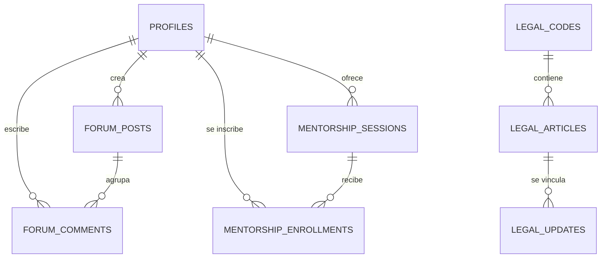

# ⚖  IusZac — Derecho Digital

## Documentación Técnica y de Pantallas · Versión 3.0
*Estado real del proyecto — Junio 2026*

────────────────────────────────────────────────────────────────────────────────

### Leyenda de Estado de Implementación

*   **✅ Implementado:** Funcionalidad completa y conectada a la base de datos de Supabase.
*   **⚠️ Parcial:** Interfaz construida pero con pendientes de backend menores o filtros específicos en desarrollo.
*   **🔲 Pendiente:** En fase de planeación de interfaz y lógica.

---

## 1. Resumen Ejecutivo y Stack Tecnológico

IusZac es una plataforma integral para la comunidad legal de Zacatecas. Facilita el acceso a la legislación actualizada local y federal, alertas de reformas estructuradas comparativamente, foros de debate dinámicos con uso de hashtags, y un directorio de mentorías con caducidad automatizada.

### Stack Técnico Homologado

| **Capa** | **Tecnología** | **Detalles Técnicos** |
| --- | --- | --- |
| **Frontend** | Flutter 3.x (Dart) | Compilado para Web (HTML/Canvas) y optimizado como PWA instalable en móviles y desktop. |
| **Manejo de Estado** | `flutter_riverpod` | Inyección de dependencias reactivas a través de Providers, FutureProviders y StreamProviders. |
| **Enrutamiento** | `go_router` | Navegación por ShellRoute con barra de navegación en móvil y NavigationRail en pantallas ≥800px. |
| **Backend** | Supabase (PostgreSQL) | DB relacional, Autenticación integrada, políticas RLS activas y Triggers automáticos. |
| **Tipografía** | Google Fonts - Outfit | Estilo moderno, legible y de alta fidelidad estética. |
| **CI / CD** | GitHub Actions | Pipeline `deploy.yml` para compilar la web e inyectar el base-href automáticamente en gh-pages. |

---

## 2. Modelo de Datos (Supabase PostgreSQL)

El backend de Supabase expone las siguientes tablas principales con seguridad RLS habilitada:



### Detalle de Tablas y Columnas

1.  **`profiles`**
    *   `id`: `UUID` (PK, apunta a `auth.users`)
    *   `full_name`: `TEXT` (Requerido)
    *   `last_name`: `TEXT` (Opcional)
    *   `avatar_url`: `TEXT` (Opcional)
    *   `user_type`: `TEXT` (admin, user)
    *   `label`: `TEXT` (Opcional)
    *   `institution`: `TEXT` (Opcional)
    *   `semester_degree`: `TEXT` (Opcional)
    *   `phone_whatsapp`: `TEXT` (Opcional)
    *   `bio`: `TEXT` (Opcional)
    *   `can_mentor`: `BOOLEAN` (Def: false, Requerido)
    *   `can_publish`: `BOOLEAN` (Def: false, Requerido)
    *   `can_moderate`: `BOOLEAN` (Def: false, Requerido)
    *   `can_manage_users`: `BOOLEAN` (Def: false, Requerido)
    *   `is_suspended`: `BOOLEAN` (Def: false, Requerido)
    *   `suspended_until`: `TIMESTAMP` (Opcional)
    *   `suspension_reason`: `TEXT` (Opcional)
    *   `notif_alerts_reforma`: `BOOLEAN` (Def: true)
    *   `notif_email_resumen`: `BOOLEAN` (Def: true)
    *   `notif_foro`: `BOOLEAN` (Def: true)
    *   `notif_mentoria`: `BOOLEAN` (Def: true)
    *   `updated_at`: `TIMESTAMP`

2.  **`legal_codes`**
    *   `id`: `UUID` (PK)
    *   `name`: `TEXT` (Requerido)
    *   `description`: `TEXT` (Opcional)
    *   `status`: `TEXT` (Vigente / Actualizado)

3.  **`legal_articles`**
    *   `id`: `UUID` (PK)
    *   `code_id`: `UUID` (FK a `legal_codes`)
    *   `number`: `TEXT` (Requerido, ej: "Art. 14")
    *   `title`: `TEXT` (Requerido, ej: "Garantías Procesales")
    *   `content`: `TEXT` (Requerido)
    *   `last_reform_date`: `TIMESTAMP` (Opcional)
    *   `source_official`: `TEXT` (Opcional)
    *   `has_recent_reform`: `BOOLEAN` (Def: false)
    *   `summary_reform`: `TEXT` (Opcional)

4.  **`forum_posts`**
    *   `id`: `UUID` (PK)
    *   `title`: `TEXT` (Requerido)
    *   `content`: `TEXT` (Requerido)
    *   `user_id`: `UUID` (FK a `profiles`)
    *   `created_at`: `TIMESTAMP`
    *   `is_urgent`: `BOOLEAN` (Def: false)
    *   `tags`: `TEXT[]` (Hashtags asignados)

5.  **`forum_comments`**
    *   `id`: `UUID` (PK)
    *   `post_id`: `UUID` (FK a `forum_posts`)
    *   `user_id`: `UUID` (FK a `profiles`)
    *   `content`: `TEXT` (Requerido)
    *   `is_solution`: `BOOLEAN` (Def: false)
    *   `created_at`: `TIMESTAMP`

6.  **`legal_updates`**
    *   `id`: `UUID` (PK)
    *   `title`: `TEXT` (Requerido)
    *   `content`: `TEXT` (Requerido, JSON Delta de Quill)
    *   `category`: `TEXT` (Requerido)
    *   `image_url`: `TEXT` (Opcional)
    *   `created_at`: `TIMESTAMP`
    *   `author_id`: `UUID` (FK a `profiles`)
    *   `article_id`: `UUID` (FK a `legal_articles`, Opcional)
    *   `old_content`: `TEXT` (Opcional)
    *   `new_content`: `TEXT` (Opcional)
    *   `status`: `TEXT` (Def: 'published', Requerido)
    *   `content_type`: `TEXT` (Def: 'reforma', Requerido)
    *   `tags`: `TEXT[]` (Def: '{}')
    *   `source_name`: `TEXT` (Opcional)
    *   `source_url`: `TEXT` (Opcional)
    *   `event_start`: `TIMESTAMP` (Opcional)
    *   `event_end`: `TIMESTAMP` (Opcional)
    *   `event_location`: `TEXT` (Opcional)
    *   `event_link`: `TEXT` (Opcional)
    *   `deadline`: `TEXT` (Opcional)
    *   `published_at`: `TIMESTAMP` (Opcional)

7.  **`legal_update_articles`**
    *   `id`: `UUID` (PK)
    *   `update_id`: `UUID` (FK a `legal_updates`, ON DELETE CASCADE)
    *   `article_id`: `UUID` (FK a `legal_articles`, ON DELETE CASCADE)

8.  **`mentorship_sessions`**
    *   `id`: `UUID` (PK)
    *   `mentor_id`: `UUID` (FK a `profiles`)
    *   `title`: `TEXT` (Requerido)
    *   `specialty`: `TEXT` (Requerido)
    *   `description`: `TEXT` (Requerido)
    *   `price`: `NUMERIC` (Def: 0.0)
    *   `available_slots`: `INT` (Def: 10)
    *   `expires_at`: `TIMESTAMP` (Requerido, para soft-delete)
    *   `created_at`: `TIMESTAMP`

9.  **`mentorship_enrollments`**
    *   `id`: `UUID` (PK)
    *   `session_id`: `UUID` (FK a `mentorship_sessions`)
    *   `user_id`: `UUID` (FK a `profiles`)
    *   `enrolled_at`: `TIMESTAMP`

---

## 3. Especificación Detallada de Pantallas

---

### Pantalla 01 · Inicio / Splash / Landing
**Sección:** Autenticación  
**Ruta:** `/splash`  
**Estado:** ✅ Implementado  

#### Descripción General
Presenta el logotipo institucional (balanza/gavel), el tagline corporativo y los accesos principales.

#### Notas de Implementación
*   GoRouter utiliza un flujo de redirección automático: si existe una sesión activa de Supabase (`currentUserProvider`), navega directo a `/` (Home), de lo contrario espera interacción del usuario.

#### Interfaz y Validaciones
| **Campo / Elemento** | **Tipo** | **Requerido** | **Detalles / Validación** |
| --- | --- | --- | --- |
| Logotipo / Icono | Visual | Sí | Icono `Icons.gavel_rounded` con gradiente circular. |
| Tagline | Texto | Sí | "Derecho al alcance de todos" |
| Botón Iniciar Sesión | Botón primario | Sí | Navega a `/login` |
| Botón Registrarse | Botón secundario | Sí | Navega a `/register` |

---

### Pantalla 02 · Registro de Usuario
**Sección:** Autenticación  
**Ruta:** `/register`  
**Estado:** ✅ Implementado  

#### Descripción General
Formulario modular completo para el registro de nuevos usuarios en el ecosistema.

#### Notas de Implementación
*   Se comunica con Supabase Auth pasándole metadatos del usuario. El trigger `on_auth_user_created` en la base de datos se encarga de transferir estos metadatos a la tabla `profiles` de forma segura.

#### Interfaz y Validaciones
| **Campo / Elemento** | **Tipo** | **Requerido** | **Detalles / Validación** |
| --- | --- | --- | --- |
| Nombre(s) | Input Texto | Sí | Mínimo 2 caracteres. |
| Apellidos | Input Texto | Sí | Mínimo 2 caracteres. |
| Correo Electrónico | Input Email | Sí | Formato de correo válido y único en la base de datos. |
| Contraseña | Input Password | Sí | Mínimo 6 caracteres con botón para ocultar/mostrar. |
| Rol Profesional | Dropdown | Sí | Selección: Estudiante / Docente / Postulante / Investigador. |
| Institución | Input Texto | No | Nombre de la escuela o despacho. |
| Semestre / Grado | Input Texto | No | Ej: "5to Semestre" o "Licenciatura". |
| Registrarse | Botón | Sí | Ejecuta `signUp()`. Bloquea UI con indicador de carga. |
| Link a Login | Enlace | Sí | Navega de regreso a `/login`. |

---

### Pantalla 03 · Iniciar Sesión
**Sección:** Autenticación  
**Ruta:** `/login`  
**Estado:** ✅ Implementado  

#### Descripción General
Formulario de acceso para usuarios registrados con soporte para restablecimiento de contraseña.

#### Notas de Implementación
*   Permite el restablecimiento de contraseñas enviando un correo de recuperación automático mediante la API de Supabase Auth (`resetPasswordForEmail`).

#### Interfaz y Validaciones
| **Campo / Elemento** | **Tipo** | **Requerido** | **Detalles / Validación** |
| --- | --- | --- | --- |
| Correo Electrónico | Input Email | Sí | Valida formato mediante Regex estándar. |
| Contraseña | Input Password | Sí | Campo cifrado con toggle para ver. |
| ¿Olvidaste la contraseña?| Enlace | No | Llama a `resetPasswordForEmail()`. |
| Ingresar | Botón Primario | Sí | Ejecuta `signIn()`. Muestra error contextual en pantalla si falla. |

---

### Pantalla 04 · Inicio (Home / Dashboard)
**Sección:** Contenido Legal  
**Ruta:** `/`  
**Estado:** ✅ Implementado  

#### Descripción General
Dashboard principal que centraliza las reformas y noticias más recientes, accesos rápidos a los códigos legales e introduce el instalador PWA.

#### Boceto de Referencia (Wireframe)
```
┌──────────────────────────────────────────┐
│  Buenos días, [Nombre]              🔔 3 │
├──────────────────────────────────────────┤
│  🔍  Busca artículos, códigos o foros... │
├──────────────────────────────────────────┤
│  ┌────────────────────────────────────┐  │
│  │ 📱 ¡Instala LawApp!           [X]  │  │
│  │ Accede más rápido y sin conexión.  │  │
│  │                      [ Instalar ]  │  │
│  └────────────────────────────────────┘  │
├──────────────────────────────────────────┤
│  Reformas Recientes                      │
│  ┌────────────────────────────────────┐  │
│  │ [ NUEVO ] Código Penal · Art. 250   │  │
│  │ Se modifica la pena mínima de...   │  │
│  │ 03/06/2026           [ Ver Cambios ] │  │
│  └────────────────────────────────────┘  │
│  Códigos Disponibles                     │
│  [ Código Civil ] [ Código Penal ] [ > ] │
└──────────────────────────────────────────┘
```

#### Notas de Implementación
*   **Instalación PWA:** Utiliza `PwaHelper` condicional para evaluar si la app es instalable. El banner se muestra dinámicamente si no ha sido cerrado (`_isDismissed = false`) y el navegador emite el trigger.
*   **Consumo de datos:** Observa `legalUpdatesProvider` para el carrusel de novedades y `legalCodesProvider` para el menú de códigos inferior.

#### Interfaz y Validaciones
| **Campo / Elemento** | **Tipo** | **Requerido** | **Detalles / Validación** |
| --- | --- | --- | --- |
| Saludo Dinámico | AppBar | Sí | Saludo automático según la hora (mañana/tarde/noche) + Nombre. |
| Buscador Global | Contenedor Tap | Sí | Acción de toque navega directo a `/search`. |
| Banner de Instalación | Widget Dinámico| No | Visible solo en web si se detecta compatibilidad PWA. |
| Carrusel de Reformas | PageView | Sí | Muestra las 3 actualizaciones más recientes. |
| Insignia [NUEVO] | Badge | No | Visible si la actualización se publicó en las últimas 24 horas. |
| Códigos Disponibles | ListView Horiz. | Sí | Carrusel con accesos directos a `/codes/:id`. |

---

### Pantalla 05 · Catálogo de Códigos
**Sección:** Contenido Legal  
**Ruta:** `/codes`  
**Estado:** ✅ Implementado  

#### Descripción General
Directorio completo de leyes y códigos vigentes en el sistema para consulta individual.

#### Boceto de Referencia (Wireframe)
```
┌──────────────────────────────────────────┐
│  ←  Catálogo de Códigos                  │
├──────────────────────────────────────────┤
│  🔍  Buscar código...                    │
├──────────────────────────────────────────┤
│  ┌────────────────────────────────────┐  │
│  │ ⚖ Código Penal del Estado          │  │
│  │ 42 artículos disponibles           │  │
│  │                        [ VIGENTE ] │  │
│  └────────────────────────────────────┘  │
│  ┌────────────────────────────────────┐  │
│  │ ⚖ Constitución Política del Estado  │  │
│  │ 136 artículos disponibles          │  │
│  │                    [ ACTUALIZADO ] │  │
│  └────────────────────────────────────┘  │
└──────────────────────────────────────────┘
```

#### Notas de Implementación
*   Consume `legalCodesProvider` y realiza una comparación de búsqueda en memoria sobre el listado filtrado localmente por nombre.

#### Interfaz y Validaciones
| **Campo / Elemento** | **Tipo** | **Requerido** | **Detalles / Validación** |
| --- | --- | --- | --- |
| Buscador Inline | Input Texto | No | Filtra reactivamente la lista al escribir. |
| Tarjeta de Código | InkWell Card | Sí | Muestra título, conteo de artículos e indicador de vigencia. |
| Estado del Código | Chip | Sí | Muestra "VIGENTE" (verde) o "ACTUALIZADO" (azul). |

---

### Pantalla 06 · Listado de Artículos por Código
**Sección:** Contenido Legal  
**Ruta:** `/codes/:codeId`  
**Estado:** ✅ Implementado  

#### Descripción General
Exhibición ordenada de los artículos pertenecientes a una legislación seleccionada.

#### Interfaz y Validaciones
| **Campo / Elemento** | **Tipo** | **Requerido** | **Detalles / Validación** |
| --- | --- | --- | --- |
| Título del Código | AppBar | Sí | Nombre del código cargado por parámetros. |
| Buscador de Artículos | Input Texto | No | Filtrado en vivo por número (ej: "Art. 25") o contenido. |
| Lista de Preceptos | ListView | Sí | Muestra número del artículo, título, snippet e insignia "REFORMADO" si aplica. |
| Enlace de Navegación | Tap | Sí | Navega a `/article/:id` para lectura completa. |

---

### Pantalla 07 · Detalle de Artículo
**Sección:** Contenido Legal  
**Ruta:** `/article/:id`  
**Estado:** ✅ Implementado  

#### Descripción General
Lector dedicado para un artículo específico, con formato inteligente de términos legales clave.

#### Boceto de Referencia (Wireframe)
```
┌──────────────────────────────────────────┐
│  ←                                       │
├──────────────────────────────────────────┤
│  ART. 250 · CÓDIGO PENAL                 │
│                                          │
│  Falsificación de Documentos             │
│  📅 Última reforma: 03/06/2026           │
│  Fuente: Periódico Oficial del Estado    │
│  ──────────────────────────────────────  │
│  Texto Vigente                           │
│                                          │
│  Comete el delito de falsificación quien │
│  altere un documento público para        │
│  obtener un beneficio indebido o causar  │
│  daño. Se sancionará con **prisión**...  │
└──────────────────────────────────────────┘
```

#### Notas de Implementación
*   *Nota de Cambio Importante:* Se removió toda la lógica de guardar/bookmark por requerimiento, eliminando el botón de acción de favoritos en la `AppBar` para limpiar la interfaz.
*   **Formateador Semántico:** Filtra el texto del artículo y aplica estilo de negrita automáticamente a palabras críticas como: *sanción, prisión, multa, delito, pena, años*.

#### Interfaz y Validaciones
| **Campo / Elemento** | **Tipo** | **Requerido** | **Detalles / Validación** |
| --- | --- | --- | --- |
| Insignia de Identidad | Container | Sí | Número de artículo y nombre del código origen. |
| Metadatos de Reforma | Fila de Texto | Sí | Fecha de la última reforma y fuente de publicación oficial. |
| Caja de Alerta | Contenedor | No | Visible solo si `hasRecentReform` es true; contiene resumen de la reforma. |
| Cuerpo del Artículo | RichText | Sí | Texto completo con formato destacado en palabras reservadas. |

---

### Pantalla 08 · Búsqueda Global
**Sección:** Contenido Legal  
**Ruta:** `/search`  
**Estado:** ✅ Implementado  

#### Descripción General
Buscador unificado del sistema para recuperar artículos, códigos o foros.

#### Interfaz y Validaciones
| **Campo / Elemento** | **Tipo** | **Requerido** | **Detalles / Validación** |
| --- | --- | --- | --- |
| Campo de Búsqueda | Input Auto-focus | Sí | Enfoca el cursor automáticamente al abrir la pantalla. |
| Búsquedas Recientes | Wrap de Chips | No | Muestra los últimos términos consultados; permite borrarlos. |
| Sugerencias Populares | Lista estática | Sí | Accesos rápidos a artículos consultados con frecuencia. |
| Resultados en Tiempo Real| ListView | Sí | Muestra tarjetas coincidentes agrupadas por tipo. |

---

### Pantalla 09 · Alertas de Reforma (Feed)
**Sección:** Alertas  
**Ruta:** `/alerts`  
**Estado:** ✅ Implementado  

#### Descripción General
Historial continuo de cambios y reformas legales publicadas en el estado.

#### Boceto de Referencia (Wireframe)
```
┌──────────────────────────────────────────┐
│  Alertas de Reforma                      │
├──────────────────────────────────────────┤
│  HOY                                     │
│  ┌────────────────────────────────────┐  │
│  │ Código Penal · Art. 250             │  │
│  │ Se modifica la pena de fraude.     │  │
│  │ 08/06/2026                 [ NEW ] │  │
│  └────────────────────────────────────┘  │
│  AYER                                    │
│  ┌────────────────────────────────────┐  │
│  │ Constitución · Art. 14              │  │
│  │ Adición sobre garantías.           │  │
│  │ 07/06/2026                         │  │
│  └────────────────────────────────────┘  │
└──────────────────────────────────────────┘
```

#### Notas de Implementación
*   Consume `legalUpdatesProvider`. Se ordena cronológicamente mostrando las últimas modificaciones.

#### Interfaz y Validaciones
| **Campo / Elemento** | **Tipo** | **Requerido** | **Detalles / Validación** |
| --- | --- | --- | --- |
| Tarjeta de Alerta | Card Widget | Sí | Muestra título, extracto explicativo y fecha. |
| Insignia [NEW] | Chip | No | Se dibuja de color rojo/naranja si la publicación tiene menos de 24 horas. |
| Click en Tarjeta | Navegación | Sí | Redirige a `/alerts/detail/:id` para inspección comparativa. |

---

### Pantalla 10 · Detalle de Reforma (Comparativo)
**Sección:** Alertas  
**Ruta:** `/alerts/detail/:id`  
**Estado:** ✅ Implementado  

#### Descripción General
Vista analítica que contrasta el texto anterior con el texto nuevo tras una modificación legal.

#### Boceto de Referencia (Wireframe)
```
┌──────────────────────────────────────────┐
│  ← Comparativa de Reforma                │
├──────────────────────────────────────────┤
│  Reforma al Art. 250 (Código Penal)      │
│                                          │
│  TEXTO ANTERIOR                          │
│  ┌────────────────────────────────────┐  │
│  │ <s>Se sancionará con prisión de    │  │
│  │ una multa de 10 a 50 días.</s>      │  │
│  └────────────────────────────────────┘  │
│                                          │
│  TEXTO NUEVO                             │
│  ┌────────────────────────────────────┐  │
│  │ Se sancionará con multa equivalente │  │
│  │ de 50 a 200 UMA vigentes.          │  │
│  └────────────────────────────────────┘  │
│  🏛 Periódico Oficial   📅 08/06/2026    │
└──────────────────────────────────────────┘
```

#### Notas de Implementación
*   *Nota de Cambio Importante:* Se eliminó el botón de guardar artículo para simplificar el flujo y adaptarlo a la baja del módulo de favoritos.
*   Carga la información detallada desde la actualización seleccionada, mostrando los bloques con colores distintivos de fondo (rojo para texto derogado, verde para el nuevo texto aprobado).

#### Interfaz y Validaciones
| **Campo / Elemento** | **Tipo** | **Requerido** | **Detalles / Validación** |
| --- | --- | --- | --- |
| Bloque Texto Anterior | Contenedor Rojo | Sí | Muestra `oldContent` tachado (`TextDecoration.lineThrough`). |
| Bloque Texto Nuevo | Contenedor Verde| Sí | Muestra `newContent` o `content` en color verde negrita. |
| Datos de la Gaceta | IconRow | Sí | Fuente oficial de publicación y fecha exacta de registro. |

---

### Pantalla 11 · Foro de Dudas (Lista de Hilos)
**Sección:** Foros  
**Ruta:** `/forum`  
**Estado:** ✅ Implementado  

#### Descripción General
Espacio para consultas académicas y debates organizado en una lista de hilos de discusión.

#### Interfaz y Validaciones
| **Campo / Elemento** | **Tipo** | **Requerido** | **Detalles / Validación** |
| --- | --- | --- | --- |
| Barra de Búsqueda | LawTextField | No | Filtra reactivamente por título de la duda o `#hashtag`. |
| Tarjeta de Hilo | InkWell Card | Sí | Avatar de autor con iniciales, nombre, rol, título de la duda y tags. |
| Recuento de Respuestas| Text Icon | Sí | Muestra la cantidad real de comentarios guardados. |
| Insignia URGENTE | Chip Rojo | No | Visible si `isUrgent` fue marcado por el creador. |
| Botón Nueva Publicación| FAB Gradiente | Sí | Botón flotante que redirige al formulario de creación. |

---

### Pantalla 12 · Detalle de Hilo (Foro)
**Sección:** Foros  
**Ruta:** `/forum/:id`  
**Estado:** ✅ Implementado  

#### Descripción General
Conversación detallada sobre una duda planteada con soporte para respuestas.

#### Notas de Implementación
*   Al crear una respuesta mediante `createComment()`, se invalida tanto `forumCommentsProvider` como `forumPostsProvider`, garantizando que el contador de comentarios en la lista principal se actualice de inmediato.

#### Interfaz y Validaciones
| **Campo / Elemento** | **Tipo** | **Requerido** | **Detalles / Validación** |
| --- | --- | --- | --- |
| Tarjeta del Post | Container | Sí | Encabezado del autor, título de la duda y cuerpo completo del mensaje. |
| Listado de Comentarios | ListView | Sí | Muestra las respuestas en orden cronológico ascendente. |
| Insignia de Solución | Chip Verde | No | Destaca el comentario con fondo verde si fue elegido como respuesta correcta. |
| Caja de Comentario | LawTextField | Sí | Input sticky inferior para redactar. Mínimo 1 carácter. |
| Enviar | FAB Pequeño | Sí | Icono de envío; activa un CircularProgressIndicator mientras guarda. |

---

### Pantalla 13 · Nueva Publicación de Foro
**Sección:** Foros  
**Ruta:** `/forum/new`  
**Estado:** ✅ Implementado  

#### Descripción General
Formulario de creación de hilos para debatir o consultar dudas con la comunidad.

#### Interfaz y Validaciones
| **Campo / Elemento** | **Tipo** | **Requerido** | **Detalles / Validación** |
| --- | --- | --- | --- |
| Título del Hilo | Input Texto | Sí | Mínimo 5 caracteres. |
| Contenido / Explicación| Input Multilínea | Sí | Mínimo 10 caracteres. |
| Asunto Urgente | Switch / Check | No | Activa la insignia `is_urgent` en el feed. |
| Hashtags | Input Texto | No | Separados por comas; se parsean automáticamente a una lista. |
| Publicar Hilo | Botón | Sí | Ejecuta `createForumPost()`, invalida lista y retorna a `/forum`. |

---

### Pantalla 14 · Mentorías (Lista de Sesiones)
**Sección:** Mentorías  
**Ruta:** `/mentorship`  
**Estado:** ✅ Implementado  

#### Descripción General
Directorio de asesorías y clases privadas programadas por profesores e investigadores de la comunidad.

#### Boceto de Referencia (Wireframe)
```
┌──────────────────────────────────────────┐
│  Mentorías                               │
├──────────────────────────────────────────┤
│  [ Todas ]   [ Mías ]   [ Participo ]    │
├──────────────────────────────────────────┤
│  🔍  Buscar por título o materia...      │
├──────────────────────────────────────────┤
│  ┌────────────────────────────────────┐  │
│  │ Dr. Ricardo Gómez           ★ 4.8  │  │
│  │ Técnicas de Litigación Penal       │  │
│  │ Materia: Derecho Penal             │  │
│  │ Cupos: 5/10         Costo: Gratis  │  │
│  │                        [ INSCRITO ]│  │
│  └────────────────────────────────────┘  │
│                                    [ + ] │
└──────────────────────────────────────────┘
```

#### Notas de Implementación
*   **Pestañas (Tabs):** Organiza en 3 secciones: *Todas* (catálogo general), *Mías* (creadas por el usuario autenticado) y *Participo* (inscripciones activas).
*   **Caducidad Automática:** Las sesiones cuya fecha límite (`expires_at`) es anterior a la hora actual se filtran automáticamente y no se muestran.

#### Interfaz y Validaciones
| **Campo / Elemento** | **Tipo** | **Requerido** | **Detalles / Validación** |
| --- | --- | --- | --- |
| Selector de Pestañas | TabBar | Sí | Cambia los conjuntos de datos de mentorías. |
| Buscador de Sesión | LawTextField | No | Filtra localmente por título de mentoría o especialidad. |
| Tarjeta de Mentoría | Card Widget | Sí | Muestra mentor, calificación, materia, precio (o chip "Gratis") y cupos. |
| Botón Agregar Sesión | FAB Flotante | No | Visible solo para perfiles con rol de Docente o Investigador para crear sesiones. |

---

### Pantalla 15 · Detalle de Mentoría
**Sección:** Mentorías  
**Ruta:** `/mentorship/:id`  
**Estado:** ✅ Implementado  

#### Descripción General
Ficha completa de la sesión de mentoría que muestra temarios y permite la auto-inscripción.

#### Interfaz y Validaciones
| **Campo / Elemento** | **Tipo** | **Requerido** | **Detalles / Validación** |
| --- | --- | --- | --- |
| Encabezado Técnico | Container | Sí | Muestra título, especialidad, mentor, precio y cupos remanentes. |
| Calendario / Horario | IconRow | Sí | Fecha y hora en que se impartirá. |
| Descripción Completa | Text block | Sí | Objetivos y temario de la sesión. |
| Botón Inscribirse | Botón Primario | Sí | Llama a `enrollInSession()`. Se bloquea si el cupo es igual a 0. |

---

### Pantalla 16 · Nueva Sesión de Mentoría
**Sección:** Mentorías  
**Ruta:** `/mentorship/new`  
**Estado:** ✅ Implementado  

#### Descripción General
Formulario para crear y ofertar una nueva sesión de mentoría en la comunidad.

#### Interfaz y Validaciones
| **Campo / Elemento** | **Tipo** | **Requerido** | **Detalles / Validación** |
| --- | --- | --- | --- |
| Título de la Sesión | Input Texto | Sí | Título descriptivo del taller. |
| Especialidad | Input Texto | Sí | Área del derecho en que se enfoca. |
| Fecha Límite | DatePicker | Sí | Fecha de vigencia de la sesión (`expires_at`). |
| Costo / Precio | Input Numérico | Sí | Por defecto 0 (Gratis). Solo números válidos. |
| Cupos Disponibles | Input Numérico | Sí | Cantidad máxima de estudiantes admitidos. |
| Temario / Descripción | TextArea | Sí | Objetivos de aprendizaje y requisitos. |
| Publicar Mentoría | Botón | Sí | Llama a `createMentorshipSession()` y refresca el listado. |

---

### Pantalla 17 · Perfil de Usuario
**Sección:** Perfil  
**Ruta:** `/profile`  
**Estado:** ✅ Implementado  

#### Descripción General
Ficha de perfil del usuario con acceso rápido al editor de datos y estadísticas generales de actividad.

#### Notas de Implementación
*   *Nota de Cambio Importante:* Se retiró toda la lógica y visualización de "Artículos Guardados". La tarjeta de estadísticas en la fila superior ahora solo muestra de manera proporcional las métricas de **Aportes** y **Mentorías**.

#### Interfaz y Validaciones
| **Campo / Elemento** | **Tipo** | **Requerido** | **Detalles / Validación** |
| --- | --- | --- | --- |
| Tarjeta de Perfil Hero | Container | Sí | Gradiente con avatar circular de iniciales, nombre y rol. |
| Insignia de Rol | Icono | No | Icono de verificado visible si el rol es Docente o Investigador. |
| Tarjeta Estadísticas | Fila de Cards | Sí | Conteo de "Aportes" y "Mentorías" vinculadas al ID del usuario. |
| Editar Perfil | Bottom Sheet | Sí | Abre formulario modal para actualizar datos personales en Supabase. |
| Cerrar Sesión | Botón Rojo | Sí | Diálogo de confirmación antes de destruir el token de sesión. |

---

### Pantalla 18 · Ajustes de Perfil
**Sección:** Perfil  
**Ruta:** `/profile/settings`  
**Estado:** ✅ Implementado  

#### Descripción General
Panel de configuración para notificaciones y seguridad de la cuenta de usuario.

#### Interfaz y Validaciones
| **Campo / Elemento** | **Tipo** | **Requerido** | **Detalles / Validación** |
| --- | --- | --- | --- |
| Switches Notificación | SwitchListTile | Sí | Cambios directos de `notif_` con guardado automático al cambiar. |
| Cambiar Contraseña | ListTile Tap | Sí | Envía correo automático de cambio de contraseña. |
| Zona de Peligro | Container Rojo | Sí | Acceso a la baja definitiva. |
| Botón Eliminar Cuenta | Botón | Sí | Alerta de confirmación en dos pasos antes de depurar el perfil. |

---

### Pantalla 19 · Panel de Administración (Admin Dashboard)
**Sección:** Administración  
**Ruta:** `/admin`  
**Estado:** ✅ Implementado  

#### Descripción General
Tablero de control exclusivo para perfiles con rol `admin` para la revisión de actividad y contenidos.

#### Boceto de Referencia (Wireframe)
```
┌──────────────────────────────────────────┐
│  🛡  Panel de Administración             │
├──────────────────────────────────────────┤
│  ┌──────────────┐  ┌──────────────────┐  │
│  │ 📰 Publicar  │  │ 📚 Gestionar     │  │
│  │   Noticia    │  │    Códigos       │  │
│  └──────────────┘  └──────────────────┘  │
│                                          │
│  Actividad Global                        │
│  Noticias: 42   Foros: 18   Usuarios: 95 │
│                                          │
│  Publicaciones Recientes                 │
│  ┌────────────────────────────────────┐  │
│  │ Art. 250 CP · 03/06/2026      ✏  🗑 │  │
│  │ Art. 14 Const · 01/06/2026     ✏  🗑 │  │
│  └────────────────────────────────────┘  │
│                                    [ + ] │
└──────────────────────────────────────────┘
```

#### Notas de Implementación
*   Se bloquea la carga de la pantalla a nivel GoRouter si el rol almacenado en `profiles` no es `admin`.

#### Interfaz y Validaciones
| **Campo / Elemento** | **Tipo** | **Requerido** | **Detalles / Validación** |
| --- | --- | --- | --- |
| Botón Publicar Noticia | Tarjeta Tap | Sí | Navega directo a `/admin/new-update`. |
| Indicadores de Actividad| Grid | Sí | Conteos consolidados de tablas clave en Supabase. |
| Lista de Cambios | ListView | Sí | Muestra las últimas 5 reformas publicadas; permite borrarlas directamente. |

---

### Pantalla 20 · Formulario: Publicar Noticia Legal
**Sección:** Administración  
**Ruta:** `/admin/new-update`  
**Estado:** ✅ Implementado  

#### Descripción General
Formulario dinámico adaptado al tipo de contenido seleccionado para que administradores o usuarios con permisos de publicación inserten reformas, noticias, eventos y convocatorias usando un editor de texto enriquecido (Quill) y programen o guarden borradores.

#### Boceto de Referencia (Wireframe)
```
┌──────────────────────────────────────────┐
│  ← Crear Publicación                     │
├──────────────────────────────────────────┤
│  Tipo de Contenido        Estado         │
│  [ Reforma    ▼ ]        [ Borrador  ▼ ] │
│                                          │
│  Título de la publicación                │
│  ┌────────────────────────────────────┐  │
│  │ Ingresa el título aquí...          │  │
│  └────────────────────────────────────┘  │
│  Categoría                Etiquetas      │
│  [ Penal      ▼ ]        [ penal, ley  ] │
│                                          │
│  [ Negrita ] [ Cursiva ] [ Lista ]       │
│  ┌────────────────────────────────────┐  │
│  │ Cuerpo del Contenido (Editor Quill)│  │
│  └────────────────────────────────────┘  │
│  [ Cancelar ]          [ Guardar/Publicar]│
└──────────────────────────────────────────┘
```

#### Interfaz y Validaciones
| **Campo / Elemento** | **Tipo** | **Requerido** | **Detalles / Validación** |
| --- | --- | --- | --- |
| Tipo de Contenido | Dropdown | Sí | Selección: Reforma / Noticia / Evento / Convocatoria. Cambia dinámicamente los campos mostrados. |
| Estado | Dropdown | Sí | Selección: Publicar ahora / Borrador / Programar (muestra selector de fecha futura si se programa). |
| Título | Input Texto | Sí | Mínimo 5 caracteres. |
| Categoría | Dropdown | Sí | Selección de la categoría temática (ej. Penal, Civil, Constitucional). |
| Etiquetas | Input Texto | No | Lista separada por comas parseada a arreglo. |
| Editor Quill | Widget Rich-Text | Sí | Cuerpo en texto enriquecido guardado como Delta JSON. |
| Sección Reforma | Dinámico | No | Muestra selector de Código, selector de Artículo y cuadros de Texto Anterior y Texto Nuevo. |
| Sección Evento | Dinámico | No | Muestra fecha de inicio/fin, ubicación y enlace de registro. |
| Sección Convocatoria | Dinámico | No | Muestra fecha límite de recepción de documentos/postulación. |

---

### Pantalla 21 · Gestión de Usuarios y Permisos
**Sección:** Administración  
**Ruta:** `/admin/users`  
**Estado:** ✅ Implementado  

#### Descripción General
Panel interactivo para administrar el listado de usuarios de la plataforma, filtrar y configurar individualmente permisos de mentoría, publicación, moderación y suspender perfiles.

#### Interfaz y Validaciones
| **Campo / Elemento** | **Tipo** | **Requerido** | **Detalles / Validación** |
| --- | --- | --- | --- |
| Buscador | Input Texto | No | Filtra reactivamente por nombre, apellido, correo, institución o biografía. |
| Filtros | Chips | Sí | Filtra la lista por: Todos, Con Permisos (can_mentor, can_publish, can_moderate, admin), Suspendidos. |
| Tarjeta de Usuario | Tarjeta | Sí | Muestra avatar, nombre completo, rol básico, etiquetas, chips de permisos activos (🎓 Mentor, 📰 Editor, 🛡 Moderador, 👑 Admin) e insignia "SUSPENDIDO" (con tiempo restante). |
| Botón Permisos | Botón | Sí | Abre un Bottom Sheet contextual para editar los permisos y acceder a la suspensión. |
| Toggles de Permisos | SwitchListTile | Sí | Controla de manera granular: "Puede publicar mentorías" (`can_mentor`), "Puede publicar noticias" (`can_publish`) y "Puede moderar contenido" (`can_moderate`). |
| Guardar Cambios | Botón | Sí | Llama al RPC `admin_set_permissions()` para aplicar los cambios de manera atómica. |

---

### Pantalla 23 · Formulario de Suspensión de Usuarios
**Sección:** Administración  
**Ruta:** `/admin/suspend/:userId` (o Modal Dialog flotante)  
**Estado:** ✅ Implementado  

#### Descripción General
Diálogo o ventana emergente dedicada a aplicar suspensiones temporales a usuarios infractores indicando un motivo detallado, o levantar suspensiones existentes de forma anticipada.

#### Interfaz y Validaciones
| **Campo / Elemento** | **Tipo** | **Requerido** | **Detalles / Validación** |
| --- | --- | --- | --- |
| Resumen de Perfil | Visual | Sí | Muestra nombre completo, rol actual y estado actual del usuario a suspender. |
| Duración | Chips de opción | Sí | Opciones rápidas de 1, 3, 7, 15, 30 días, o "Personalizado" (activa un DatePicker de fecha fin). |
| Motivo | Input Texto | Sí | Campo de texto multilínea descriptivo (mínimo 10 caracteres). |
| Aplicar Suspensión | Botón | Sí | Llama a la base de datos a través del RPC `admin_suspend_user()` e invalida los perfiles y estadísticas. |
| Levantar Suspensión | Botón | No | Visible únicamente si el usuario está suspendido; llama al RPC `admin_lift_suspension()`. |

---

### Pantalla 24 · Aviso de Cuenta Suspendida
**Sección:** Autenticación  
**Ruta:** `/suspended`  
**Estado:** ✅ Implementado  

#### Descripción General
Pantalla de bloqueo de seguridad sin barra de navegación a la que es redirigido de manera forzosa todo usuario que cuente con una suspensión vigente al intentar utilizar la app.

#### Interfaz y Validaciones
| **Campo / Elemento** | **Tipo** | **Requerido** | **Detalles / Validación** |
| --- | --- | --- | --- |
| Icono de Bloqueo | Visual | Sí | Icono de stop/restringido en color rojo. |
| Fecha de Finalización | Texto | Sí | Muestra el día y hora exactos en español en los que expira la sanción. |
| Motivo de Sanción | Contenedor | Sí | Texto explicativo del motivo de la suspensión ingresado por el administrador. |
| Cerrar Sesión | Botón | Sí | Ejecuta el método `signOut()`, borra la sesión de Supabase Auth y redirige al usuario a `/splash`. |

---

## 4. Enrutamiento y Flujos de Navegación (`lib/core/router.dart`)

El enrutador está construido sobre GoRouter y define la jerarquía de navegación principal:

```
/splash (Splash inicial de bienvenida)
 ├── /login (Ingreso de usuario)
 ├── /register (Creación de cuenta)
 └── /suspended (Pantalla de bloqueo por suspensión activa)

/ [ShellRoute - MainLayout]
 ├── / (Inicio / Dashboard - con chips de tipo de contenido y visualización dinámica de eventos/convocatorias)
 ├── /forum (Lista de dudas del foro)
 │    ├── /forum/new (Nueva duda)
 │    └── /forum/:id (Detalle de duda y respuestas)
 ├── /alerts (Feed de reformas)
 │    └── /alerts/detail/:id (Comparativa y Lector de texto enriquecido Quill)
 ├── /mentorship (Lista de mentorías)
 │    ├── /mentorship/new (Publicar mentoría)
 │    └── /mentorship/:id (Temario e inscripción)
 ├── /profile (Perfil de usuario)
 │    └── /profile/settings (Ajustes de notificaciones)
 ├── /codes (Catálogo de Códigos)
 │    └── /codes/:codeId (Artículos del código)
 ├── /article/:id (Lector del artículo individual)
 ├── /search (Búsqueda global)
 └── /admin (Dashboard Administrador - Administra publicaciones por tabs)
      ├── /admin/new-update (Formulario de publicación de cambios con Quill)
      ├── /admin/users (Administración granular de perfiles y permisos)
      └── /admin/moderation (Moderación de posts y comentarios)
```

---

## 5. Proveedores de Estado Riverpod (`lib/providers/database_provider.dart`)

La aplicación maneja el estado reactivo con los siguientes Riverpod Providers:

| **Provider** | **Tipo** | **Descripción / Origen** |
| --- | --- | --- |
| `databaseServiceProvider` | `Provider` | Inicializa el servicio de base de datos `DatabaseService`. |
| `legalUpdatesProvider` | `FutureProvider` | Retorna el listado de actualizaciones públicas vigentes (`status = 'published'`). |
| `myDraftsProvider` | `FutureProvider` | Retorna los borradores del usuario actual (`status = 'draft'`). |
| `scheduledUpdatesProvider` | `FutureProvider` | Retorna las publicaciones programadas del usuario actual (`status = 'scheduled'`). |
| `forumPostsProvider` | `FutureProvider` | Obtiene los hilos activos del foro con autor y comentarios. |
| `forumCommentsProvider` | `FutureProvider.family`| Obtiene las respuestas asociadas a un post por su `postId`. |
| `mentorsProvider` | `FutureProvider` | Directorio de mentores con perfil verificado. |
| `mentorshipSessionsProvider`| `FutureProvider` | Obtiene mentorías activas no expiradas (`expires_at > now`). |
| `enrolledSessionsProvider` | `FutureProvider` | Lista de mentorías a las que se ha inscrito el usuario. |
| `legalCodesProvider` | `FutureProvider` | Carga de los códigos vigentes y conteo dinámico de artículos. |
| `articlesByCodeProvider` | `FutureProvider.family`| Artículos de ley que corresponden a un código por `codeId`. |
| `featuredArticleProvider` | `FutureProvider` | Obtiene el primer artículo en base de datos para el home. |
| `articleDetailProvider` | `FutureProvider.family`| Carga datos de un artículo mediante su `articleId` (JOIN a código). |
| `profileStatsProvider` | `FutureProvider` | Conteo de aportes en foro y mentorías del perfil activo. |
| `allUsersProvider` | `FutureProvider` | Carga la lista completa de perfiles para administración. |
| `suspendedUsersProvider` | `FutureProvider` | Filtra únicamente los usuarios suspendidos vigentes. |
| `isSuspendedProvider` | `Provider` | Evalúa síncronamente si el usuario actual está suspendido. |

---

## 6. Historial de Cambios y Hitos Completados

### Hitos de la Versión 5.0 (Junio 2026)
*   **Granularidad de Permisos**: Migración completa del esquema de roles basado en `userType` a una tabla y modelo de perfiles con banderas booleanas específicas (`can_mentor`, `can_publish`, `can_moderate`, `can_manage_users`), soportado por el RPC atómico `admin_set_permissions()`.
*   **Editor Quill y Tipos de Publicación**: Actualización e integración completa de `flutter_quill` v11.x, permitiendo cuerpo en texto enriquecido. Implementación de formulario dinámico para insertar Reformas (con artículo e historial de texto comparativo), Noticias, Eventos (con fechas y lugar) y Convocatorias (con fecha límite).
*   **Soporte de Visualización de Quill**: Incorporación de un widget lector inteligente `QuillContentViewer` en la vista de detalle de reformas, detectando el formato JSON Delta para mostrarlo con estilos tipográficos correctos o caer en texto plano si no se dispone del formato.
*   **Organización del Panel por Pestañas**: Reestructuración del panel de administración para catalogar las noticias en pestañas dedicadas: "Publicadas", "Borradores" (empleando `myDraftsProvider`) y "Programadas" (empleando `scheduledUpdatesProvider`), logrando un workflow de administración limpio.
*   **Sistema y Vista de Suspensión**: Implementación de bloqueo forzoso para usuarios suspendidos a través de la pantalla `/suspended` y su guard en GoRouter, complementado con el modal dialog interactivo de suspensión administrada con cálculo rápido de días y motivo obligatorio.

### Hitos de la Versión 3.0 (Junio 2026)
*   **Implementación de Instalación PWA:** Creación de un helper dinámico en Dart (`PwaHelper`) con soporte interop para web mediante `dart:js` y stubs para no romper la compilación nativa en móviles. Añade un banner estético en el Home que ejecuta el prompt del navegador para la instalación.
*   **Corrección del Contador de Comentarios:** Corregido el error en el feed de foros donde las respuestas siempre aparecían en 0. Se adaptaron las consultas para resolver e invalidar el caché de publicaciones (`forumPostsProvider`) al insertar una respuesta, forzando la actualización instantánea del recuento.
*   **Depuración de Marcadores (Saved Articles):** Se eliminó por completo la sección visual de favoritos, limpiando el perfil, el feed, las vistas de lectura y las comparativas de reforma.
*   **Limpieza de Permisos y Scripts SQL:** Consolidación de políticas RLS y triggers de creación de perfiles para evitar errores de autenticación y lectura.
